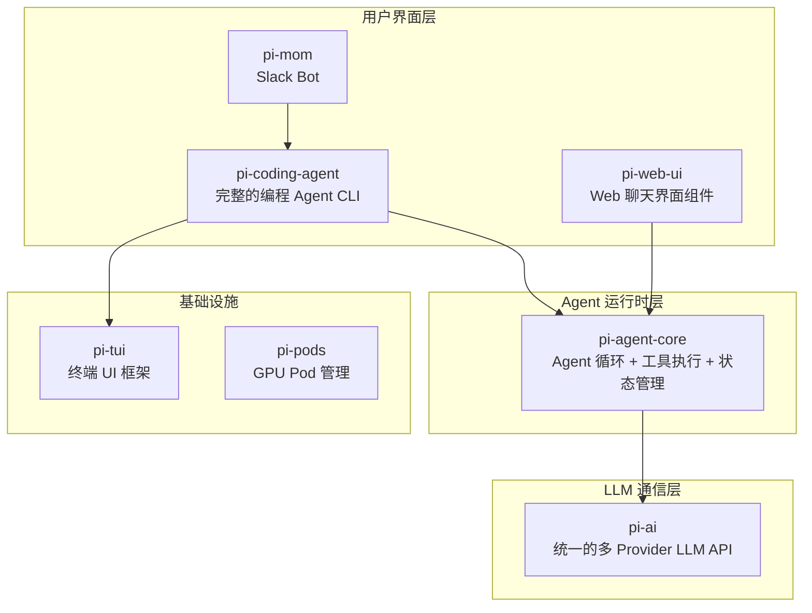
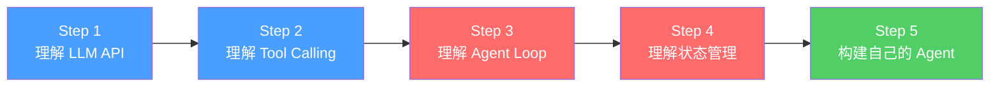
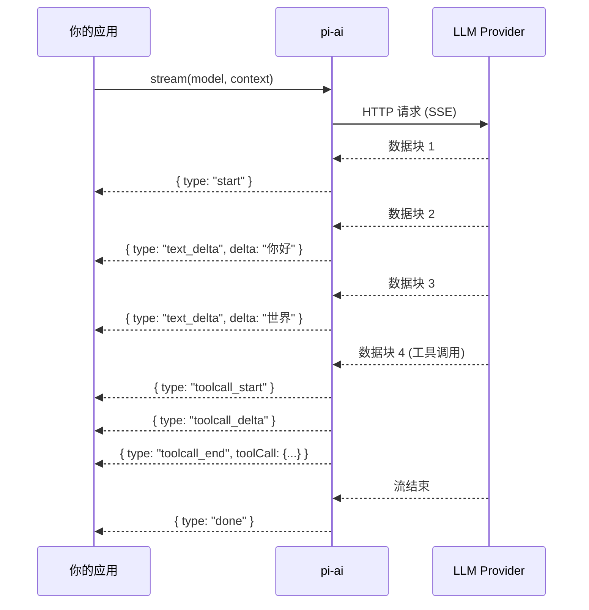
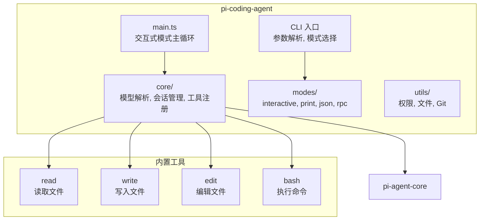
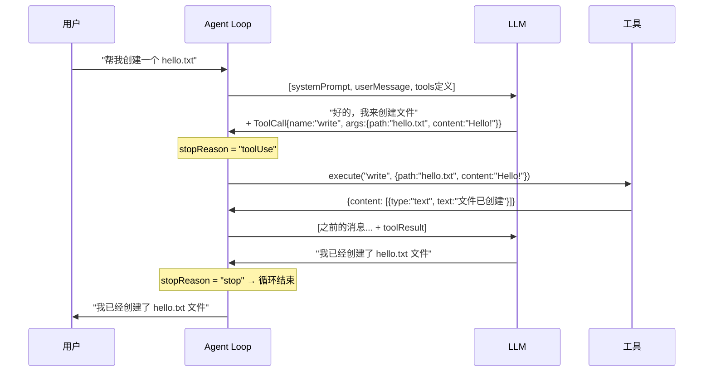
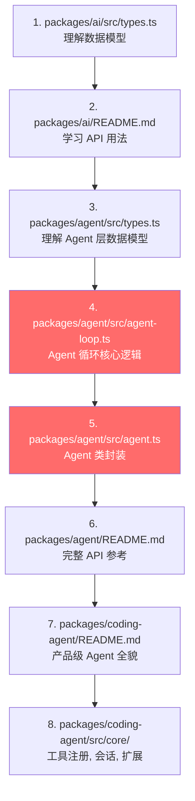

# 从 pi-mono 入手学习 Agent 开发

> 本指南以 [pi-mono](https://github.com/badlogic/pi-mono) 仓库为学习载体，带你从零掌握 AI Agent 的核心概念和工程实践。

---

## 目录

1. [Agent 是什么?](#1-agent-是什么)
2. [pi-mono 整体架构](#2-pi-mono-整体架构)
3. [学习路线图](#3-学习路线图)
4. [第一层 — LLM 通信层 (pi-ai)](#4-第一层--llm-通信层-pi-ai)
5. [第二层 — Agent 运行时 (pi-agent-core)](#5-第二层--agent-运行时-pi-agent-core)
6. [第三层 — 完整的 Coding Agent (pi-coding-agent)](#6-第三层--完整的-coding-agent-pi-coding-agent)
7. [关键概念深度解析](#7-关键概念深度解析)
8. [动手练习](#8-动手练习)
9. [进阶学习方向](#9-进阶学习方向)
10. [推荐阅读源码的顺序](#10-推荐阅读源码的顺序)

---

## 1. Agent 是什么?

一个 AI Agent 本质上是一个 **"LLM + 工具调用循环"**：

```
用户输入 → LLM 思考 → (调用工具 → 获取结果 → LLM 再思考) × N → 最终回答
```

与普通的 ChatBot 不同，Agent 可以：
- **使用工具 (Tool Calling)**：读写文件、执行命令、搜索网页等
- **自主决策**：根据工具返回结果决定下一步行动
- **多轮迭代**：反复调用工具直到任务完成

> [!IMPORTANT]
> Agent 的核心不是 LLM 本身，而是围绕 LLM 构建的 **工具调用循环 (Agent Loop)** 和 **状态管理**。

---

## 2. pi-mono 整体架构

pi-mono 是一个 monorepo，由底层到上层分为以下包：



| 包名 | 职责 | 学习价值 |
|------|------|---------|
| [pi-ai](file:///d:/MCPs/pi-mono/packages/ai) | 统一的 LLM API，支持 20+ Provider | 理解如何与 LLM 通信 |
| [pi-agent-core](file:///d:/MCPs/pi-mono/packages/agent) | Agent 循环、工具执行、事件流 | **核心 — Agent 的灵魂** |
| [pi-coding-agent](file:///d:/MCPs/pi-mono/packages/coding-agent) | 完整的编程 Agent 实现 | 理解生产级 Agent 的全貌 |
| [pi-tui](file:///d:/MCPs/pi-mono/packages/tui) | 终端差异渲染 UI 框架 | 理解 Agent 的展示层 |
| [pi-web-ui](file:///d:/MCPs/pi-mono/packages/web-ui) | Web 组件化聊天界面 | 理解 Agent 的 Web 端集成 |

---

## 3. 学习路线图



> [!TIP]
> 建议按 **pi-ai → pi-agent-core → pi-coding-agent** 的顺序学习。这三层分别对应 Agent 开发的三个核心问题：怎么和 LLM 说话？怎么让 LLM 用工具？怎么把它做成产品？

---

## 4. 第一层 — LLM 通信层 (pi-ai)

### 4.1 核心概念

pi-ai 解决的问题：**把不同 LLM Provider 的 API 差异屏蔽掉，提供统一的调用接口**。

关键文件：[types.ts](file:///d:/MCPs/pi-mono/packages/ai/src/types.ts)

#### 消息类型体系

LLM 对话由三种消息类型组成：

```typescript
// 用户消息
interface UserMessage {
  role: "user";
  content: string | (TextContent | ImageContent)[];
  timestamp: number;
}

// 助手回复（LLM 生成）
interface AssistantMessage {
  role: "assistant";
  content: (TextContent | ThinkingContent | ToolCall)[]; // 可包含文本、思考、工具调用
  usage: Usage;         // token 用量和费用
  stopReason: StopReason; // 停止原因："stop" | "toolUse" | "error" ...
}

// 工具结果
interface ToolResultMessage {
  role: "toolResult";
  toolCallId: string;   // 关联到哪个工具调用
  toolName: string;
  content: (TextContent | ImageContent)[]; // 支持文本和图片
  isError: boolean;
}
```

> [!NOTE]
> **关键洞察**：`AssistantMessage.content` 是一个数组，可以同时包含文本、思考过程和工具调用。当 `stopReason === "toolUse"` 时，表示 LLM 希望调用工具，你需要执行工具并把结果作为 `ToolResultMessage` 发回去。

#### Context 和 Tool 定义

```typescript
// 对话上下文
interface Context {
  systemPrompt?: string;  // 系统提示词
  messages: Message[];    // 对话历史
  tools?: Tool[];         // 可用工具列表
}

// 工具定义（使用 TypeBox 做类型安全校验）
interface Tool {
  name: string;           // 工具名
  description: string;    // 告诉 LLM 这个工具能做什么
  parameters: TSchema;    // JSON Schema 参数定义
}
```

### 4.2 流式调用详解

pi-ai 的流式 API 是事件驱动的：

```typescript
import { getModel, stream } from '@mariozechner/pi-ai';

const model = getModel('anthropic', 'claude-sonnet-4-20250514');
const s = stream(model, context);

for await (const event of s) {
  // event.type 可能的值：
  // "start"          → 流开始
  // "text_delta"     → 收到一段文本
  // "thinking_delta" → 收到一段思考（推理模型）
  // "toolcall_start" → 工具调用开始
  // "toolcall_delta" → 工具调用参数逐步流入
  // "toolcall_end"   → 工具调用完成，可以执行了
  // "done"           → 流结束
  // "error"          → 出错
}

const finalMessage = await s.result(); // 获取完整的助手消息
```

#### 事件流时序图



### 4.3 关键源码指引

| 文件 | 内容 | 为什么要读 |
|------|------|-----------|
| [types.ts](file:///d:/MCPs/pi-mono/packages/ai/src/types.ts) | 所有核心类型定义 | 理解消息、工具、上下文的数据结构 |
| [stream.ts](file:///d:/MCPs/pi-mono/packages/ai/src/stream.ts) | `stream()` / `complete()` 入口 | 理解统一调用入口的实现 |
| [providers/](file:///d:/MCPs/pi-mono/packages/ai/src/providers) | 各 Provider 实现 | 理解如何适配不同 LLM API |
| [models.ts](file:///d:/MCPs/pi-mono/packages/ai/src/models.ts) | 模型注册和查询 | 理解模型发现机制 |

---

## 5. 第二层 — Agent 运行时 (pi-agent-core)

### 5.1 核心 — Agent Loop

这是整个 Agent 架构的灵魂。阅读 [agent-loop.ts](file:///d:/MCPs/pi-mono/packages/agent/src/agent-loop.ts)。

Agent Loop 的核心逻辑用伪代码表示：

```
function agentLoop(userMessage, context, config):
    发射 agent_start 事件
    将 userMessage 加入 context
    
    while true:
        发射 turn_start 事件
        
        // 1. 调用 LLM
        assistantMessage = streamAssistantResponse(context)
        
        // 2. 检查是否需要调用工具
        toolCalls = assistantMessage 中所有 type === "toolCall" 的内容块
        
        if 没有 toolCalls:
            发射 turn_end 事件
            break  // 结束循环
        
        // 3. 执行工具
        for each toolCall in toolCalls:
            发射 tool_execution_start
            result = 查找并执行对应的工具
            发射 tool_execution_end
            将 toolResult 加入 context
        
        发射 turn_end 事件
        // 回到 while 循环顶部，LLM 会看到工具结果再次思考
    
    发射 agent_end 事件
```

#### 实际的事件流

```
prompt("读取 config.json 并告诉我版本号")
├─ agent_start
├─ turn_start                          ← 第一轮
│  ├─ message_start  (userMessage)
│  ├─ message_end    (userMessage)
│  ├─ message_start  (assistantMessage: 我来读取文件...)
│  ├─ message_update × N              ← 流式输出
│  ├─ message_end    (assistantMessage with toolCall: read_file)
│  ├─ tool_execution_start             ← 执行 read_file
│  ├─ tool_execution_end               ← 返回文件内容
│  ├─ message_start  (toolResultMessage)
│  ├─ message_end    (toolResultMessage)
│  └─ turn_end
├─ turn_start                          ← 第二轮（LLM 看到文件内容后回答）
│  ├─ message_start  (assistantMessage: 版本号是 1.2.3)
│  ├─ message_update × N
│  ├─ message_end
│  └─ turn_end
└─ agent_end
```

### 5.2 AgentMessage vs LLM Message

> [!IMPORTANT]
> 这是 pi-agent-core 中最重要的设计决策之一。

Agent 内部使用 `AgentMessage`，但 LLM 只理解标准的 `Message`（user/assistant/toolResult）。这个中间层允许应用添加自定义消息类型：

```
AgentMessage[]  →  transformContext()  →  AgentMessage[]  →  convertToLlm()  →  Message[]  →  LLM
(应用层消息)        (裁剪/注入)            (转换后的消息)       (过滤+转换)        (LLM能理解的)
```

```typescript
// 应用可以通过 declaration merging 添加自定义消息类型
declare module "@mariozechner/pi-agent-core" {
  interface CustomAgentMessages {
    notification: { role: "notification"; text: string; timestamp: number };
  }
}

// 在 convertToLlm 中处理自定义类型
convertToLlm: (messages) => messages.flatMap(m => {
  if (m.role === "notification") return []; // 过滤掉（UI only）
  return [m]; // 标准消息直接传递
})
```

### 5.3 Tool 定义

Agent 层的工具定义比 LLM 层多了 `execute` 和 `label`：

```typescript
const readFileTool: AgentTool = {
  name: "read_file",
  label: "Read File",                                  // UI 显示用
  description: "Read a file's contents",               // 告诉 LLM 用途
  parameters: Type.Object({                            // TypeBox 类型校验
    path: Type.String({ description: "File path" }),
  }),
  execute: async (toolCallId, params, signal, onUpdate) => {
    // params 已经通过 TypeBox 自动校验
    const content = await fs.readFile(params.path, "utf-8");
    
    // 可以流式更新进度
    onUpdate?.({ content: [{ type: "text", text: "Reading..." }], details: {} });
    
    // 返回结果
    return {
      content: [{ type: "text", text: content }],
      details: { path: params.path, size: content.length },
    };
  },
};
```

> [!TIP]
> 工具失败时应 **throw Error**，不要在 content 中返回错误。Agent 会自动把异常包装成 `isError: true` 的 `ToolResultMessage`，让 LLM 知道出错了并可以重试。

### 5.4 Agent 类

[Agent 类](file:///d:/MCPs/pi-mono/packages/agent/src/agent.ts) 是对 `agentLoop` 的高层封装，提供了：

- **状态管理** (`agent.state`)：model, systemPrompt, tools, messages, thinkingLevel
- **事件订阅** (`agent.subscribe()`): 订阅 Agent 生命周期事件
- **流式控制** (`agent.abort()`, `agent.waitForIdle()`): 取消和等待
- **消息注入** (`agent.steer()`, `agent.followUp()`): 中途干预 Agent

```typescript
const agent = new Agent({
  initialState: {
    systemPrompt: "You are a helpful assistant.",
    model: getModel("anthropic", "claude-sonnet-4-20250514"),
    thinkingLevel: "off",
    tools: [readFileTool],
    messages: [],
  },
  convertToLlm: (messages) => messages.filter(m => 
    ["user", "assistant", "toolResult"].includes(m.role)
  ),
});

// 订阅事件，驱动 UI 更新
agent.subscribe((event) => {
  switch (event.type) {
    case "message_update":
      if (event.assistantMessageEvent.type === "text_delta") {
        process.stdout.write(event.assistantMessageEvent.delta);
      }
      break;
    case "tool_execution_start":
      console.log(`正在执行: ${event.toolName}`);
      break;
  }
});

await agent.prompt("Hello!");
```

### 5.5 关键源码指引

| 文件 | 内容 | 为什么要读 |
|------|------|-----------|
| [types.ts](file:///d:/MCPs/pi-mono/packages/agent/src/types.ts) | AgentMessage, AgentTool, AgentEvent 等类型 | 理解 Agent 层的数据模型 |
| [agent-loop.ts](file:///d:/MCPs/pi-mono/packages/agent/src/agent-loop.ts) | Agent 循环的核心实现 | **最重要的文件 — Agent 的心脏** |
| [agent.ts](file:///d:/MCPs/pi-mono/packages/agent/src/agent.ts) | Agent 类，高层状态管理 | 理解如何封装 agent loop |
| [proxy.ts](file:///d:/MCPs/pi-mono/packages/agent/src/proxy.ts) | 浏览器代理实现 | 理解如何在浏览器中使用 Agent |

---

## 6. 第三层 — 完整的 Coding Agent (pi-coding-agent)

pi-coding-agent 是一个生产级的编程 Agent，在 pi-agent-core 之上构建了：



### 它在 pi-agent-core 之上增加了什么？

| 功能 | 说明 |
|------|------|
| **内置工具** (read, write, edit, bash) | 4 个核心文件操作和命令执行工具 |
| **会话管理** | JSONL 格式持久化，支持分支和恢复 |
| **上下文压缩 (Compaction)** | 当对话过长时自动/手动总结历史 |
| **多模式运行** | interactive / print / json / rpc |
| **扩展系统** | Extensions, Skills, Prompt Templates, Themes |
| **模型选择** | 20+ Provider 的模型发现和切换 |

> [!NOTE]
> pi-coding-agent 的哲学是 "极简核心 + 极致可扩展"。它故意不内置子 Agent、计划模式、权限弹窗等功能，而是提供 Extension API 让你自己构建。

---

## 7. 关键概念深度解析

### 7.1 Tool Calling — Agent 的手

Tool Calling 是 Agent 与外部世界交互的方式。流程如下：



### 7.2 Event-Driven Architecture — Agent 的神经系统

pi-agent-core 使用事件驱动架构来解耦 Agent 逻辑和 UI 渲染：

```typescript
// Agent 产生事件
agent.subscribe(async (event, signal) => {
  switch (event.type) {
    case "agent_start":         // Agent 开始处理
    case "turn_start":          // 新一轮 LLM 调用开始
    case "message_start":       // 消息开始（user/assistant/toolResult）
    case "message_update":      // 助手消息流式更新
    case "message_end":         // 消息结束
    case "tool_execution_start":// 工具开始执行
    case "tool_execution_update": // 工具执行进度
    case "tool_execution_end":  // 工具执行完成
    case "turn_end":            // 一轮结束
    case "agent_end":           // Agent 完成所有工作
  }
});
```

这种设计使得：
- **TUI** (pi-tui) 可以监听事件来实时渲染终端 UI
- **Web UI** (pi-web-ui) 可以监听事件来更新 Web 组件
- **RPC/JSON 模式**可以监听事件来序列化输出
- 你也可以构建自己的 UI

### 7.3 Streaming — Agent 的呼吸

整个系统是双层流式的：

```
LLM 流式输出 → pi-ai AssistantMessageEvent → pi-agent-core AgentEvent → UI 渲染
```

这意味着用户可以**实时看到**：
1. LLM 正在"思考"什么 (thinking_delta)
2. LLM 正在"说"什么 (text_delta)
3. LLM 正在调用什么工具 (toolcall_delta — 参数逐步流入)
4. 工具执行了什么 (tool_execution_update)

### 7.4 Context Management — Agent 的记忆

Agent 的"记忆"就是 `messages` 数组。但 LLM 有 context window 限制，所以需要管理：

```typescript
// transformContext: 在发给 LLM 之前裁剪/注入消息
transformContext: async (messages, signal) => {
  if (estimateTokens(messages) > MAX_TOKENS) {
    return compactMessages(messages); // 总结旧消息
  }
  return messages;
}
```

pi-coding-agent 的 Compaction 功能就是一种 context management 策略。

### 7.5 Steering & Follow-up — Agent 的方向盘

Agent 运行时，用户可以：
- **Steering（转向）**：在 Agent 执行工具时插入消息，改变方向
- **Follow-up（追加）**：在 Agent 完成后追加新任务

```typescript
// Agent 正在执行工具时，用户发送：
agent.steer({
  role: "user",
  content: "停！不要删除那个文件！",
  timestamp: Date.now(),
});

// Agent 完成后，追加任务：
agent.followUp({
  role: "user",
  content: "另外，帮我也更新一下 README",
  timestamp: Date.now(),
});
```

---

## 8. 动手练习

### 练习 1: 最小 LLM 调用

目标：理解 pi-ai 的基本用法。

```typescript
// 创建一个脚本，使用 pi-ai 调用 LLM 并打印流式输出
import { getModel, stream } from '@mariozechner/pi-ai';

const model = getModel('openai', 'gpt-4o-mini'); // 需要设置 OPENAI_API_KEY

const s = stream(model, {
  messages: [{ role: 'user', content: '用一句话解释什么是 Agent', timestamp: Date.now() }]
});

for await (const event of s) {
  if (event.type === 'text_delta') {
    process.stdout.write(event.delta);
  }
}
console.log(); // 换行
```

### 练习 2: 带工具调用的 LLM

目标：理解 Tool Calling 的完整流程。

```typescript
import { Type, getModel, complete } from '@mariozechner/pi-ai';

const model = getModel('openai', 'gpt-4o-mini');

const tools = [{
  name: 'get_time',
  description: '获取当前时间',
  parameters: Type.Object({
    timezone: Type.Optional(Type.String({ description: '时区' }))
  })
}];

// 第一次调用：LLM 会返回工具调用
const context = {
  messages: [{ role: 'user', content: '现在几点了？', timestamp: Date.now() }],
  tools
};

const response = await complete(model, context);
context.messages.push(response);

// 处理工具调用
for (const block of response.content) {
  if (block.type === 'toolCall') {
    const result = new Date().toLocaleString();
    context.messages.push({
      role: 'toolResult',
      toolCallId: block.id,
      toolName: block.name,
      content: [{ type: 'text', text: result }],
      isError: false,
      timestamp: Date.now()
    });
  }
}

// 第二次调用：LLM 用工具结果回答用户
const finalResponse = await complete(model, context);
console.log(finalResponse.content[0]); // 文本回答
```

### 练习 3: 最小 Agent

目标：使用 pi-agent-core 构建一个可以读取文件的最小 Agent。

```typescript
import { Agent } from "@mariozechner/pi-agent-core";
import { getModel, Type } from "@mariozechner/pi-ai";
import fs from "fs";

const readTool = {
  name: "read_file",
  label: "Read File",
  description: "读取文件内容",
  parameters: Type.Object({
    path: Type.String({ description: "文件路径" }),
  }),
  execute: async (id, params) => {
    const content = fs.readFileSync(params.path, "utf-8");
    return {
      content: [{ type: "text", text: content }],
      details: { path: params.path },
    };
  },
};

const agent = new Agent({
  initialState: {
    systemPrompt: "你是一个有用的助手，可以读取文件。",
    model: getModel("openai", "gpt-4o-mini"),
    thinkingLevel: "off",
    tools: [readTool],
    messages: [],
  },
  convertToLlm: (msgs) => msgs.filter(m => 
    ["user", "assistant", "toolResult"].includes(m.role)
  ),
});

agent.subscribe((event) => {
  if (event.type === "message_update" && event.assistantMessageEvent.type === "text_delta") {
    process.stdout.write(event.assistantMessageEvent.delta);
  }
  if (event.type === "tool_execution_start") {
    console.log(`\n[工具调用] ${event.toolName}(${JSON.stringify(event.args)})`);
  }
});

await agent.prompt("请读取 package.json 并告诉我项目名称和版本号");
```

### 练习 4: 阅读 Agent Loop 源码

目标：逐行阅读 [agent-loop.ts](file:///d:/MCPs/pi-mono/packages/agent/src/agent-loop.ts) 并回答以下问题：

1. `runLoop()` 函数中，外层 `while(true)` 和内层 `while` 分别控制什么？
2. 当 LLM 返回 `stopReason === "error"` 时，Agent 做了什么？
3. `prepareToolCall()` 中，哪些情况会导致 `ImmediateToolCallOutcome`（不执行工具）？
4. 并行工具执行 (`executeToolCallsParallel`) 和顺序执行 (`executeToolCallsSequential`) 的区别在哪？
5. Steering messages 是在什么时机被检查的？

---

## 9. 进阶学习方向

学完基础后，可以深入以下方向：

| 方向 | 在 pi-mono 中的体现 | 关键文件/目录 |
|------|---------------------|--------------|
| **扩展系统设计** | Extensions API | `packages/coding-agent/src/core/` |
| **会话持久化** | JSONL Session 格式 | `packages/coding-agent/src/core/` |
| **多 Provider 适配** | 20+ Provider 实现 | `packages/ai/src/providers/` |
| **终端 UI 开发** | 差异渲染引擎 | `packages/tui/src/` |
| **Web AI 应用** | Web Component 化 | `packages/web-ui/src/` |
| **上下文压缩** | Compaction 策略 | coding-agent compaction |
| **安全与权限** | beforeToolCall hook | agent-core types |

---

## 10. 推荐阅读源码的顺序



> [!CAUTION]
> 不建议一开始就读 `packages/coding-agent/src/main.ts`，它有 600+ 行且涉及大量 TUI 交互代码。先从 `agent-loop.ts`（~630 行，逻辑清晰）入手理解核心，再逐步扩展到上层。

---

## 总结

| 你想理解的问题 | 答案在哪 |
|---------------|---------|
| 怎么调用 LLM？ | `packages/ai/` — 统一的流式 API |
| 怎么让 LLM 用工具？ | `packages/ai/` 的 Tool 定义 + `packages/agent/` 的 Agent Loop |
| Agent 循环怎么工作？ | `packages/agent/src/agent-loop.ts` — **核心中的核心** |
| 怎么管理 Agent 状态？ | `packages/agent/src/agent.ts` — Agent 类 |
| 怎么做一个完整产品？ | `packages/coding-agent/` — 生产级参考实现 |
| 怎么做 Web 端 Agent？ | `packages/web-ui/` — Web Components |

祝你学习愉快！有任何问题随时来问。
