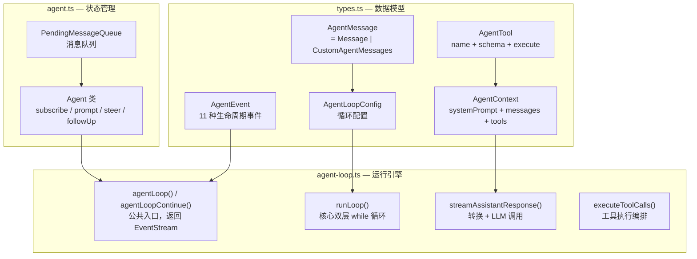
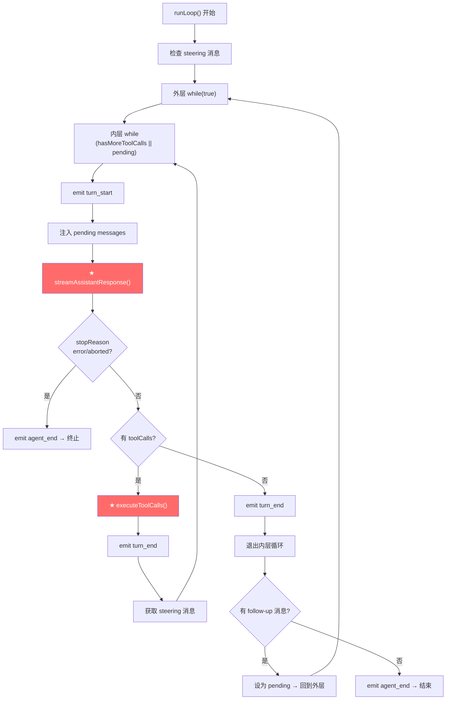
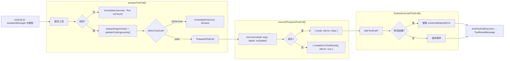
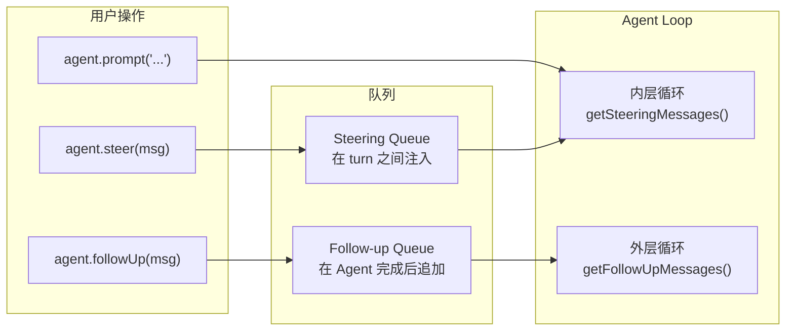

# pi-agent-core 深度学习指南

> `@mariozechner/pi-agent-core` — Agent 架构的灵魂。只有 **5 个文件**，但每一个都至关重要。

---

## 目录

1. [包总览](#1-包总览)
2. [文件导航地图](#2-文件导航地图)
3. [types.ts — 类型系统](#3-typests--类型系统)
4. [agent-loop.ts — Agent 循环（核心中的核心）](#4-agent-loopts--agent-循环核心中的核心)
5. [agent.ts — Agent 类（状态机封装）](#5-agentts--agent-类状态机封装)
6. [proxy.ts — 代理流（浏览器/远程场景）](#6-proxyts--代理流浏览器远程场景)
7. [关键设计决策](#7-关键设计决策)
8. [源码精读练习](#8-源码精读练习)

---

## 1. 包总览

```
packages/agent/src/
├── types.ts        ← 所有类型定义（342 行）
├── agent-loop.ts   ← Agent 循环核心逻辑（632 行）★ 最重要
├── agent.ts        ← Agent 类，状态机封装（540 行）
├── proxy.ts        ← Proxy stream，用于浏览器（341 行）
└── index.ts        ← 导出入口（177 行）
```

**设计哲学**：整个包不到 2000 行代码，零外部依赖（仅依赖 `pi-ai`），却实现了一个完整的 Agent 运行时。极简、可组合、易测试。

---

## 2. 文件导航地图



---

## 3. types.ts — 类型系统

> 文件：[types.ts](file:///d:/MCPs/pi-mono/packages/agent/src/types.ts)

### 3.1 AgentMessage — 可扩展的消息类型

```typescript
// 基础消息：LLM 能理解的
type StandardMessage = UserMessage | AssistantMessage | ToolResultMessage;

// Agent 消息 = 标准消息 + 自定义消息
type AgentMessage = StandardMessage | CustomAgentMessages[keyof CustomAgentMessages];

// 自定义消息通过 declaration merging 扩展
interface CustomAgentMessages {
  // 空的，等待上层通过 declaration merging 扩展
}
```

> [!IMPORTANT]
> **为什么要这样设计？** LLM 只认识 user/assistant/toolResult，但应用可能需要额外的消息类型（如 bash 执行结果、压缩摘要）。`AgentMessage` 让这些自定义类型可以存在于 Agent 的消息流中，在发给 LLM 之前通过 `convertToLlm()` 过滤/转换掉。

### 3.2 AgentTool — 工具定义

```typescript
interface AgentTool<TParams extends TSchema = TSchema> {
  name: string;                              // 工具名（LLM 用这个来调用）
  label?: string;                            // UI 显示标签
  description: string;                       // 告诉 LLM 这个工具做什么
  parameters: TParams;                       // TypeBox JSON Schema
  prepareArguments?: (raw: unknown) => Static<TParams>; // 参数预处理
  execute: (                                 // 执行函数
    toolCallId: string,
    params: Static<TParams>,
    signal: AbortSignal | undefined,
    onUpdate?: AgentToolUpdateCallback<any>,  // 进度回调
  ) => Promise<AgentToolResult<any>>;
}
```

**关键点**：
- `parameters` 使用 TypeBox，在运行时自动校验 LLM 传来的参数
- `execute` 的 `signal` 支持取消操作
- `onUpdate` 回调允许工具流式报告进度
- `prepareArguments` 允许在校验前修正 LLM 的参数格式错误

### 3.3 AgentEvent — 11 种生命周期事件

```typescript
type AgentEvent =
  // 生命周期
  | { type: "agent_start" }                     // Agent 开始处理
  | { type: "agent_end"; messages: AgentMessage[] } // Agent 结束
  
  // Turn 级别
  | { type: "turn_start" }                      // 一轮 LLM 调用开始
  | { type: "turn_end"; message: AssistantMessage; toolResults: ToolResultMessage[] }
  
  // 消息级别
  | { type: "message_start"; message: AgentMessage }
  | { type: "message_update"; assistantMessageEvent: AssistantMessageEvent; message: AgentMessage }
  | { type: "message_end"; message: AgentMessage }
  
  // 工具级别
  | { type: "tool_execution_start"; toolCallId: string; toolName: string; args: any }
  | { type: "tool_execution_update"; toolCallId: string; toolName: string; partialResult: any }
  | { type: "tool_execution_end"; toolCallId: string; toolName: string; result: any; isError: boolean };
```

### 3.4 AgentLoopConfig — 循环配置

```typescript
interface AgentLoopConfig extends SimpleStreamOptions {
  model: Model<any>;                          // 使用的模型
  
  // 两个关键转换器
  convertToLlm: (messages: AgentMessage[]) => Message[] | Promise<Message[]>;
  transformContext?: (messages: AgentMessage[], signal?: AbortSignal) => Promise<AgentMessage[]>;
  
  // 工具执行 hook
  beforeToolCall?: (ctx: BeforeToolCallContext, signal?) => Promise<BeforeToolCallResult | undefined>;
  afterToolCall?: (ctx: AfterToolCallContext, signal?) => Promise<AfterToolCallResult | undefined>;
  
  // 消息注入
  getSteeringMessages?: () => Promise<AgentMessage[]>;
  getFollowUpMessages?: () => Promise<AgentMessage[]>;
  
  // 执行策略
  toolExecution?: "parallel" | "sequential";
}
```

---

## 4. agent-loop.ts — Agent 循环（核心中的核心）

> 文件：[agent-loop.ts](file:///d:/MCPs/pi-mono/packages/agent/src/agent-loop.ts) — **632 行，Agent 的心脏**

### 4.1 公共入口

```typescript
// 新对话入口：添加 prompt 消息并开始循环
export function agentLoop(prompts, context, config, signal?, streamFn?): EventStream<AgentEvent>

// 续接入口：从当前 context 继续（用于重试）
export function agentLoopContinue(context, config, signal?, streamFn?): EventStream<AgentEvent>
```

两者都返回 `EventStream<AgentEvent, AgentMessage[]>` — 一个异步可迭代的事件流。

### 4.2 核心循环 — runLoop()

这是 **最重要的函数**。我来逐段注释：

```typescript
async function runLoop(currentContext, newMessages, config, signal, emit, streamFn) {
  let firstTurn = true;
  // 检查是否有 steering 消息（用户在 Agent 等待时输入的）
  let pendingMessages = (await config.getSteeringMessages?.()) || [];

  // ═══ 外层循环：处理 follow-up 消息 ═══
  while (true) {
    let hasMoreToolCalls = true;

    // ═══ 内层循环：处理 tool calls + steering 消息 ═══
    while (hasMoreToolCalls || pendingMessages.length > 0) {
      
      // 1. 发射 turn_start
      if (!firstTurn) await emit({ type: "turn_start" });
      else firstTurn = false;

      // 2. 处理 pending messages（steering 消息注入）
      if (pendingMessages.length > 0) {
        for (const message of pendingMessages) {
          await emit({ type: "message_start", message });
          await emit({ type: "message_end", message });
          currentContext.messages.push(message);
          newMessages.push(message);
        }
        pendingMessages = [];
      }

      // 3. ★ 调用 LLM 获取助手回复
      const message = await streamAssistantResponse(currentContext, config, signal, emit, streamFn);
      newMessages.push(message);

      // 4. 错误/中止检查
      if (message.stopReason === "error" || message.stopReason === "aborted") {
        await emit({ type: "turn_end", message, toolResults: [] });
        await emit({ type: "agent_end", messages: newMessages });
        return; // 终止循环
      }

      // 5. ★ 检查并执行工具调用
      const toolCalls = message.content.filter(c => c.type === "toolCall");
      hasMoreToolCalls = toolCalls.length > 0;

      if (hasMoreToolCalls) {
        const toolResults = await executeToolCalls(...);
        for (const result of toolResults) {
          currentContext.messages.push(result);
          newMessages.push(result);
        }
      }

      await emit({ type: "turn_end", message, toolResults });
      
      // 6. 检查新的 steering 消息
      pendingMessages = (await config.getSteeringMessages?.()) || [];
    }
    // ← 内层循环结束：没有更多 tool calls 且没有 steering 消息

    // 7. ★ 检查 follow-up 消息
    const followUpMessages = (await config.getFollowUpMessages?.()) || [];
    if (followUpMessages.length > 0) {
      pendingMessages = followUpMessages;
      continue; // 回到外层循环
    }

    break; // 彻底结束
  }

  await emit({ type: "agent_end", messages: newMessages });
}
```

### 4.3 双层循环控制图



### 4.4 streamAssistantResponse() — LLM 调用边界

这是 **AgentMessage 到 LLM Message 的转换发生处**：

```typescript
async function streamAssistantResponse(context, config, signal, emit, streamFn) {
  // 1. transformContext: AgentMessage[] → AgentMessage[]（可选裁剪/注入）
  let messages = context.messages;
  if (config.transformContext) {
    messages = await config.transformContext(messages, signal);
  }

  // 2. ★ convertToLlm: AgentMessage[] → Message[]（过滤自定义类型）
  const llmMessages = await config.convertToLlm(messages);

  // 3. 构建 LLM Context
  const llmContext = {
    systemPrompt: context.systemPrompt,
    messages: llmMessages,
    tools: context.tools,
  };

  // 4. 调用 stream function
  const response = await streamFunction(config.model, llmContext, { ...config, signal });

  // 5. 将流事件转换为 AgentEvent 并发射
  for await (const event of response) {
    switch (event.type) {
      case "start":
        // 把 partial message 推入 context
        context.messages.push(event.partial);
        await emit({ type: "message_start", message: event.partial });
        break;
      case "text_delta":
      case "toolcall_delta":
      case /* ...其他 delta... */:
        // 更新 context 中的最后一条消息
        context.messages[context.messages.length - 1] = event.partial;
        await emit({ type: "message_update", assistantMessageEvent: event, message: event.partial });
        break;
      case "done":
      case "error":
        // 用最终消息替换 partial
        const finalMessage = await response.result();
        context.messages[context.messages.length - 1] = finalMessage;
        await emit({ type: "message_end", message: finalMessage });
        return finalMessage;
    }
  }
}
```

> [!NOTE]
> **关键洞察**：`context.messages` 在流式过程中是 **实时更新** 的。`partial message` 在 `start` 时被推入，每次 delta 都会替换最后一条消息。这意味着如果你在流式过程中检查 `context.messages`，你能看到 LLM 正在生成的内容。

### 4.5 工具执行管线



**并行 vs 顺序执行**：

| 模式 | 行为 | 使用场景 |
|------|------|---------|
| `parallel` (默认) | 所有工具先 prepare，通过的工具并发 execute，结果按原顺序写入 | 独立的文件读取、搜索 |
| `sequential` | 每个工具依次 prepare → execute → finalize | 有依赖关系的操作 |

---

## 5. agent.ts — Agent 类（状态机封装）

> 文件：[agent.ts](file:///d:/MCPs/pi-mono/packages/agent/src/agent.ts)

Agent 类是对 `runAgentLoop` 的有状态封装。它管理：

### 5.1 状态 (MutableAgentState)

```typescript
interface AgentState {
  systemPrompt: string;
  model: Model<any>;
  thinkingLevel: ThinkingLevel;
  tools: AgentTool[];           // getter/setter 自动复制数组
  messages: AgentMessage[];     // getter/setter 自动复制数组
  
  // 运行时状态（只读）
  isStreaming: boolean;
  streamingMessage?: AgentMessage;
  pendingToolCalls: Set<string>;
  errorMessage?: string;
}
```

### 5.2 事件订阅 (Pub/Sub)

```typescript
const unsubscribe = agent.subscribe(async (event, signal) => {
  // event: AgentEvent
  // signal: 当前 run 的 AbortSignal
  // 返回的 Promise 会被 await，阻塞后续事件
});

unsubscribe(); // 取消订阅
```

> [!WARNING]
> 订阅者是 **按注册顺序依次 await** 的。一个慢的 listener 会阻塞所有后续 listener 和 Agent 本身。要小心异步操作。

### 5.3 消息队列系统

Agent 有两个消息队列：



**Steering（转向）**：在 Agent 执行工具时插入消息，下一轮 LLM 调用前生效。
**Follow-up（追加）**：在 Agent 本来要停止时追加新任务，让 Agent 继续。

**队列模式**：
- `"one-at-a-time"` (默认)：每次只取一条消息
- `"all"`：一次取出所有排队消息

### 5.4 processEvents() — 状态 Reducer

Agent 在发射事件给 listener 之前，先更新自身状态：

```typescript
private async processEvents(event: AgentEvent) {
  switch (event.type) {
    case "message_start":
      this._state.streamingMessage = event.message;    // 标记正在流式的消息
      break;
    case "message_update":
      this._state.streamingMessage = event.message;    // 更新流式消息
      break;
    case "message_end":
      this._state.streamingMessage = undefined;        // 清除流式标记
      this._state.messages.push(event.message);        // ★ 消息落库
      break;
    case "tool_execution_start":
      this._state.pendingToolCalls.add(event.toolCallId);  // 记录执行中的工具
      break;
    case "tool_execution_end":
      this._state.pendingToolCalls.delete(event.toolCallId); // 清除
      break;
    // ...
  }
  // → 然后 await 所有 listener
  for (const listener of this.listeners) {
    await listener(event, signal);
  }
}
```

### 5.5 生命周期管理

```typescript
// 独占运行：同一时间只有一个 prompt/continue 在运行
agent.prompt("Hello"); // 如果正在运行，会 throw

// 取消
agent.abort();

// 等待完成
await agent.waitForIdle();

// 重置
agent.reset(); // 清除 messages, runtime state, queues
```

---

## 6. proxy.ts — 代理流（浏览器/远程场景）

> 文件：[proxy.ts](file:///d:/MCPs/pi-mono/packages/agent/src/proxy.ts)

`streamProxy` 实现了一个 **Proxy Stream Function**，用于通过代理服务器调用 LLM：

```
浏览器/客户端 → HTTP POST → Proxy Server → LLM Provider
                     ← SSE events ←
```

### 为什么需要 Proxy？

1. **浏览器环境**：浏览器不能直接调用 LLM API（CORS + API key 泄露）
2. **认证集中**：服务器管理 API key，客户端只需要 auth token
3. **带宽优化**：服务器去掉 `partial` 字段（完整的消息副本），客户端自己重建

### 使用方式

```typescript
const agent = new Agent({
  streamFn: (model, context, options) =>
    streamProxy(model, context, {
      ...options,
      authToken: await getAuthToken(),
      proxyUrl: "https://genai.example.com",
    }),
});
```

---

## 7. 关键设计决策

### 7.1 为什么 AgentMessage 和 LLM Message 分离？

| 方面 | AgentMessage | LLM Message |
|------|-------------|-------------|
| 角色 | 应用层消息 | LLM 可理解的消息 |
| 类型 | user, assistant, toolResult, **+ 自定义** | user, assistant, toolResult |
| 用途 | 状态管理、UI 渲染、持久化 | 发给 LLM |
| 扩展 | declaration merging | 不可扩展 |

```
AgentMessage[] → transformContext() → convertToLlm() → Message[] → LLM
     ↑                                                                ↓
    应用状态 ←──────── processEvents() ←──────── 流式事件 ←──── AssistantMessage
```

### 7.2 为什么事件是 await 的？

Agent 事件处理是 **顺序 await** 的，不是 fire-and-forget。这保证：
- UI 渲染在下一个事件前完成
- Session 持久化在继续前完成
- `agent_end` 的所有 listener settle 后 Agent 才变为 idle

### 7.3 为什么工具执行有 prepare → execute → finalize 三阶段？

- **prepare**：查找工具、校验参数、`beforeToolCall` 拦截 → 快速失败，不执行
- **execute**：实际运行工具 → 可能耗时
- **finalize**：`afterToolCall` 后处理 → 修改结果、添加审计日志

这种分离使得 `beforeToolCall` 可以在工具执行前拦截（如权限检查），`afterToolCall` 可以在执行后修改结果（如内容审计）。

---

## 8. 源码精读练习

### 练习 1：追踪一次完整的 prompt 调用

从 `agent.prompt("Hello")` 开始，追踪以下调用链：

```
Agent.prompt()
  → normalizePromptInput()
  → runPromptMessages()
    → runWithLifecycle()
      → createContextSnapshot()
      → createLoopConfig()
      → runAgentLoop()
        → runLoop()
          → streamAssistantResponse()
            → config.transformContext()
            → config.convertToLlm()
            → streamFunction()
          → executeToolCalls() [如果有]
        → emit({ type: "agent_end" })
    → processEvents() [每个事件]
      → 更新 _state
      → await listeners
```

**问题**：
1. `createContextSnapshot()` 为什么要 `.slice()` messages 和 tools？
2. 如果 `streamAssistantResponse` 在流式过程中 throw，会怎样？
3. `agent_end` 事件和 `finishRun()` 的执行顺序是什么？

### 练习 2：实现一个 beforeToolCall

阻止所有对 `/etc/passwd` 的文件读取：

```typescript
const agent = new Agent({
  beforeToolCall: async ({ toolCall, args }) => {
    if (toolCall.name === "read" && args.path === "/etc/passwd") {
      return { block: true, reason: "Access denied: sensitive file" };
    }
    return undefined; // 允许执行
  },
  // ...
});
```

追踪源码，回答：
1. `block: true` 后，Agent 循环会怎样？（提示：看 `prepareToolCall` 返回 `ImmediateToolCallOutcome`）
2. LLM 会收到什么信息？

### 练习 3：理解 Steering vs Follow-up

```typescript
// 场景：Agent 正在执行一个耗时的 bash 命令
agent.prompt("运行 npm test");

// 用户在 Agent 执行工具时发送：
setTimeout(() => agent.steer({ role: "user", content: "跳过 e2e 测试", timestamp: Date.now() }), 1000);

// Agent 完成后追加：
setTimeout(() => agent.followUp({ role: "user", content: "然后运行 lint", timestamp: Date.now() }), 5000);
```

追踪源码，回答：
1. Steering 消息在 `runLoop()` 的哪一行被检查？（提示：216 行）
2. Follow-up 消息在哪一行被检查？（提示：220 行）
3. 如果两者同时有消息，哪个先被处理？

### 练习 4：比较并行和顺序工具执行

阅读 [agent-loop.ts L390-L438](file:///d:/MCPs/pi-mono/packages/agent/src/agent-loop.ts#L390-L438)（`executeToolCallsParallel`）和 [L350-L388](file:///d:/MCPs/pi-mono/packages/agent/src/agent-loop.ts#L350-L388)（`executeToolCallsSequential`），回答：

1. 并行模式中，`prepareToolCall` 是并发的还是顺序的？
2. 如果 3 个工具中的第 2 个在准备阶段被 `beforeToolCall` 拦截，第 3 个还会执行吗？
3. 工具结果的发射顺序和 LLM 请求中的 toolCall 顺序一致吗？

---

## 快速参考表

| 你想做什么 | 看什么 |
|-----------|--------|
| 理解 Agent 的消息/工具/事件模型 | [types.ts](file:///d:/MCPs/pi-mono/packages/agent/src/types.ts) |
| 理解 Agent 循环如何工作 | [agent-loop.ts](file:///d:/MCPs/pi-mono/packages/agent/src/agent-loop.ts) `runLoop()` |
| 理解 LLM 调用时的消息转换 | [agent-loop.ts](file:///d:/MCPs/pi-mono/packages/agent/src/agent-loop.ts) `streamAssistantResponse()` |
| 理解工具执行管线 | [agent-loop.ts](file:///d:/MCPs/pi-mono/packages/agent/src/agent-loop.ts) `executeToolCalls*()` |
| 理解 Agent 的状态管理 | [agent.ts](file:///d:/MCPs/pi-mono/packages/agent/src/agent.ts) `Agent` 类 |
| 理解消息注入（steering/follow-up） | [agent.ts](file:///d:/MCPs/pi-mono/packages/agent/src/agent.ts) `PendingMessageQueue` |
| 理解浏览器端 Agent | [proxy.ts](file:///d:/MCPs/pi-mono/packages/agent/src/proxy.ts) `streamProxy()` |
