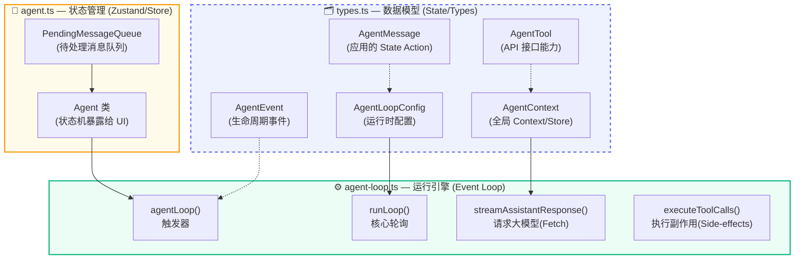
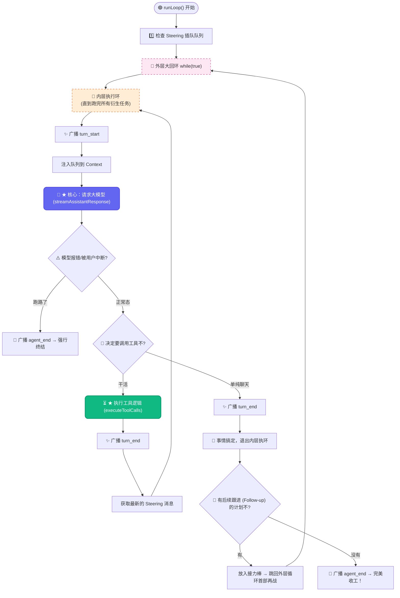
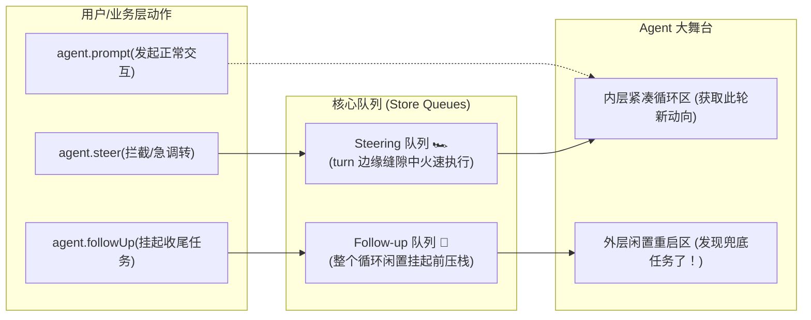

# 🤖 pi-agent-core 深度学习指南

> 💡 **写给前端同学的话**：
> 如果你熟悉 React、Redux 或者是浏览器的 Event Loop，理解 Agent 架构就会非常轻松！
> 我们大可以把 Agent 想象成一个**处理自然语言的特殊浏览器**：
> - **LLM (大模型)** 就像是一个“纯函数（Pure Function）”，接收当前的 UI State（上下文/聊天记录），计算并返回类似 Virtual DOM 的输出（新文本，或调用系统工具的“指令”）。
> - **`pi-agent-core`** 就是这个调度引擎。负责维护状态池 (State)、捕获模型指令去执行副作用（发请求读文件等）、并在数据变化时触发下一轮重新生成（Re-rendering）。
>
> `@mariozechner/pi-agent-core` — Agent 架构的灵魂。只有 **5 个核心文件**，但每一个都至关重要。

---

## 📑 目录

1. [包总览](#1-包总览)
2. [🗺️ 文件导航地图](#2-🗺️-文件导航地图)
3. [types.ts — 🧩 类型系统 (状态与规范)](#3-typests--🧩-类型系统状态与规范)
4. [agent-loop.ts — ⚙️ Agent 版的 Event Loop (核心！)](#4-agent-loopts--⚙️-agent-版的-event-loop核心)
5. [agent.ts — 🧠 状态机类 (状态管理如 Redux/Zustand)](#5-agentts--🧠-状态机类状态管理如-reduxzustand)
6. [proxy.ts — 🌐 代理流（浏览器防跨域/防密钥泄漏场景）](#6-proxyts--🌐-代理流浏览器防跨域防密钥泄漏场景)
7. [关键设计决策](#7-关键设计决策)
8. [源码精读练习](#8-源码精读练习)

---

## 1. 包总览

```text
packages/agent/src/
├── types.ts        ← 所有类型定义（342 行），数据契约中心
├── agent-loop.ts   ← Agent 循环核心逻辑（632 行）★ 最重要，驱动齿轮
├── agent.ts        ← Agent 类，暴露给 UI 的状态机封装（540 行）
├── proxy.ts        ← Proxy stream，用于前端浏览器直连（341 行）
└── index.ts        ← 导出统一入口（177 行）
```

**设计哲学**：整个包不到 2000 行代码，**零外部依赖**（仅依赖 `pi-ai`），却实现了一个完整的 Agent 运行时。极简、模块化、易测试（就跟你写小而美的前端通用库一样爽快）。

---

## 2. 🗺️ 文件导航地图



---

## 3. types.ts — 🧩 类型系统 (状态与规范)

> 文件：[types.ts](file:///d:/MCPs/pi-mono/packages/agent/src/types.ts)  
> 💡 **前端视角**：就像项目里的 `@types` 或者 `interfaces.ts`。其中最核心的，是定义了单向数据流中的 Action 和 State 规范。

### 3.1 AgentMessage — 可扩展的消息类型（单向数据流中的 Action）

```typescript
// 基础消息（基建层）：大模型原生能理解的
type StandardMessage = UserMessage | AssistantMessage | ToolResultMessage;

// Agent 消息：标准消息 + 我们在应用层的自定义消息
type AgentMessage = StandardMessage | CustomAgentMessages[keyof CustomAgentMessages];

// 自定义消息通过 TypeScript 的 declaration merging（声明合并）横向扩展
interface CustomAgentMessages {
  // 留空，等待上层模块去声明
}
```

> [!IMPORTANT]
> **为什么要这样设计？**  
> 就像 Redux 里有纯本地的状态无需上报后端一样，大模型只认识标准的对话格式（提问/回答/工具结果）。但我们在前端 UI 上，可能需要渲染花里胡哨的自定义卡片（比如“深入思考动效小工具”、“终端高亮日志界面”）。  
> `AgentMessage` 让这些**展现层级**的自定义类型共存于统一的状态流中。在发给大模型做网络请求前，顺手通过 `convertToLlm()` 把它清理/过滤成纯净的“后端报文”即可！

### 3.2 AgentTool — 暴露给大模型的“魔法接口”

```typescript
interface AgentTool<TParams extends TSchema = TSchema> {
  name: string;                              // 工具名（LLM 发送这个字符串来触发）
  label?: string;                            // UI 显示的友好中文标签
  description: string;                       // System Prompt，告诉大模型这个 API 是干嘛的
  parameters: TParams;                       // TypeBox JSON Schema 对象
  prepareArguments?: (raw: unknown) => Static<TParams>; // ★ 数据清洗中间件
  execute: (                                 // 执行函数 (核心副作用)
    toolCallId: string,
    params: Static<TParams>,
    signal: AbortSignal | undefined,
    onUpdate?: AgentToolUpdateCallback<any>,  // 进度回调
  ) => Promise<AgentToolResult<any>>;
}
```

**💡 关键点（前端同态映射）**：
- `parameters`：就像使用 Schema（如 Zod 或 Yup）去守卫前端的 Form 表单验证。这里用于运行时自动拦截大模型（可能出现的）胡说八道的长串参数。
- `execute` 中的 `signal`：就像使用 `fetch` 时的 `AbortController`，轻松提供「取消大模型深度沉思流」或耗时文件操作的能力。
- `onUpdate` 回调：就像 XHR 的 `onprogress` 事件监听！让你在 UI 层直接去渲染一个顺滑的动态进度条。
- `prepareArguments`：充当强大的 middleware（中间件），甚至在大模型的参数拼装出现极轻微的 JSON 语法断层时，我们能够去兜底洗数据！

### 3.3 AgentEvent — 11 种生命周期事件钩子 (Events)

跟 React 的 Lifecycle 类似，这里定义了最细粒度的生命周期：

```typescript
type AgentEvent =
  // 生命周期级别
  | { type: "agent_start" }                     // Agent 开始处理
  | { type: "agent_end"; messages: AgentMessage[] } // Agent 本次旅程完成结束
  
  // Turn 级别 (一次你来我往回合)
  | { type: "turn_start" }                      
  | { type: "turn_end"; message: AssistantMessage; toolResults: ToolResultMessage[] }
  
  // 消息渲染级别 (最常用！更新 UI 状态的依赖)
  | { type: "message_start"; message: AgentMessage }
  | { type: "message_update"; assistantMessageEvent: AssistantMessageEvent; message: AgentMessage }
  | { type: "message_end"; message: AgentMessage }
  
  // 工具级别 (让你显示"正在执行 xxx.js...")
  | { type: "tool_execution_start"; toolCallId: string; toolName: string; args: any }
  | { type: "tool_execution_update"; toolCallId: string; toolName: string; partialResult: any }
  | { type: "tool_execution_end"; toolCallId: string; toolName: string; result: any; isError: boolean };
```


---

## 4. agent-loop.ts — ⚙️ Agent 版的 Event Loop (核心！)

> 💡 **前端视角**：这里是真正的运行时引擎核心！类似于 React 的调和（Reconciliation）全家桶或者浏览器的宏任务/微任务派发队列。它控制着：**接收请求指令 -> 调用系统级工具产生副作用 -> 更新环境 Context 上下文 -> 再次驱动大模型思考** 的整个死循环。

> 文件：[agent-loop.ts](file:///d:/MCPs/pi-mono/packages/agent/src/agent-loop.ts) — **632 行，Agent 的心脏大动脉**

### 4.1 核心循环 — runLoop()

代码中的注释是精髓：

```typescript
async function runLoop(currentContext, newMessages, config, signal, emit, streamFn) {
  let firstTurn = true;
  // ★ 获取当前有没有插队的 Steering（急转弯）指令消息
  let pendingMessages = (await config.getSteeringMessages?.()) || [];

  // ═══ 外层循环：轮询大循环，负责清空任务池 ═══
  while (true) {
    let hasMoreToolCalls = true;

    // ═══ 内层循环：密集处理 大模型反馈与工具掉落 ═══
    while (hasMoreToolCalls || pendingMessages.length > 0) {
      
      if (!firstTurn) await emit({ type: "turn_start" });
      else firstTurn = false;

      // 1. 如果有急停发来的插队消息，压入当前上下文 (Context)
      if (pendingMessages.length > 0) {
        /* ... 略 ... */
        pendingMessages = [];
      }

      // 2. ★ 发起网络请求向 LLM 要下一句话
      const message = await streamAssistantResponse(currentContext, config, signal, emit, streamFn);
      newMessages.push(message);

      // 3. 错误中断捕获机制
      if (message.stopReason === "error" || message.stopReason === "aborted") {
        await emit({ type: "turn_end", message, toolResults: [] });
        await emit({ type: "agent_end", messages: newMessages });
        return; // 被手动取消，终止大循环
      }

      // 4. ★ 分析：大模型吐出的是普通客套话，还是系统工具操作命令？
      const toolCalls = message.content.filter(c => c.type === "toolCall");
      hasMoreToolCalls = toolCalls.length > 0;

      // 有命令！我们去执行回调副作用！
      if (hasMoreToolCalls) {
        const toolResults = await executeToolCalls(...); // -> 副作用在此发生
        /* 将结果塞回上下文 */
      }

      await emit({ type: "turn_end", message, toolResults });
      
      // 5. 再次重新获取队列中被积压的 Steering 消息
      pendingMessages = (await config.getSteeringMessages?.()) || [];
    }
    // ← 内层大循环结束：发现已经无事可做了（没有工具要调，也没有拦截的新消息）

    // 6. ★ 休息之前做最后检查：存在排在后面的“后续需求 Follow-up” 吗？
    const followUpMessages = (await config.getFollowUpMessages?.()) || [];
    if (followUpMessages.length > 0) {
      pendingMessages = followUpMessages;
      continue; // 重燃战火，提上队列直接回到顶部执行外层大循环
    }

    break; // 彻彻底底的空闲了！
  }

  await emit({ type: "agent_end", messages: newMessages });
}
```

### 4.2 双层循环控制流图 (The Loop Map)



### 4.3 streamAssistantResponse() — 边界突破口 (Data Bridge)

这是前端应用层与大模型 HTTP 层实现**解耦转换**最核心的接口枢纽地带。

```typescript
async function streamAssistantResponse(context, config, signal, emit, streamFn) {
  // 1. transformContext (管道过滤器)
  // 你可以借助这条暗道去动态脱敏/裁剪上下文中太早期的无用冗余记录！
  let messages = context.messages;
  if (config.transformContext) {
    messages = await config.transformContext(messages, signal);
  }

  // 2. ★ convertToLlm: AgentMessage[] → Message[]
  // 去伪存真，拔掉那些前端界面上看起来很炫酷、但在 LLM 视角中一无是处的“多余自定义类型标记和日志卡片”。
  const llmMessages = await config.convertToLlm(messages);

  // 3. 构建发送给老天爷（大模型服务端）的 Context
  const llmContext = { systemPrompt: context.systemPrompt, messages: llmMessages, tools: context.tools };

  // 4. 调用 fetch streaming function
  const response = await streamFunction(config.model, llmContext, { ...config, signal });

  // 5. 💥 打字机核心动效：将流事件不断吐露发射给 UI
  for await (const event of response) {
    switch (event.type) {
      case "start":
        context.messages.push(event.partial);     // 将空壳/占位符推进状态历史中去
        await emit({ type: "message_start", message: event.partial });
        break;
      case "text_delta":
      case "toolcall_delta":
        context.messages[context.messages.length - 1] = event.partial; // ⚡ 持续拼接替换最后一个壳子！
        await emit({ type: "message_update", assistantMessageEvent: event, message: event.partial });
        break;
      case "done":
        const finalMessage = await response.result(); // 落锤
        context.messages[context.messages.length - 1] = finalMessage;
        await emit({ type: "message_end", message: finalMessage });
        return finalMessage;
    }
  }
}
```

> [!NOTE]
> **✨ React 渲染层小贴士 (洞察)**：
> 上方的代码里 `context.messages` 居然直接在 Streaming 过程中被**就地覆盖式更新**了。这意味着你在每次拿到 `message_update` 后去读 Context，由于 JavaScript 引用特性，得到的状态绝对是实时正在生成的内容。直接用来投喂给 `v-for` 或者 `.map` 即可打出完美的打字机！

### 4.4 工具执行流水管线 (Tool Pipeline)

```mermaid
graph LR
    TC["拿到大模型想调用的 Tool 名称与配置"] --> PREPARE

    subgraph "第一层：拦截墙 prepareToolCall()"
        style PREPARE fill:#f4f4f5,stroke:#52525b
        PREPARE["寻址对应方法"] --> NOT_FOUND{"方法存在与否?"}
        NOT_FOUND -->|找不到| IMM1["兜底: 返回 '抱歉我没这能力'"]
        NOT_FOUND -->|找到了| PREP_ARGS["跑 validate() TypeBox 校对"]
        PREP_ARGS --> BEFORE{"有全局前置守卫 (beforeToolCall)?"}
        BEFORE -->|block拦截| IMM2["驳回: '你没权限/不允许'"]
        BEFORE -->|放行| PREPARED["封装为 Prepared 对象!"]
    end

    PREPARED --> EXECUTE

    subgraph "第二层：重武器区 executePreparedToolCall()"
        style EXECUTE fill:#fef08a,stroke:#ca8a04
        EXECUTE["🔥 tool.execute(信号, 参数)"] --> SUCCESS{"异常未抛出?"}
        SUCCESS -->|平稳执行| RESULT["得到结果 payload"]
        SUCCESS -->|Crash!| ERROR["组装 createErrorToolResult"]
    end

    RESULT --> FINALIZE

    subgraph "第三层：数据抹面 finalizeExecutedToolCall()"
        style FINALIZE fill:#bbf7d0,stroke:#16a34a
        FINALIZE["经过全局收尾 (afterToolCall)"] --> MODIFY{"开发者想要魔改它?"}
        MODIFY -->|是| PATCHED["替换 content 体并追加审计痕迹"]
        MODIFY -->|否| ORIGINAL["按兵不动"]
    end

    PATCHED --> EMIT["发送 emitToolCallOutcome!"]
    ORIGINAL --> EMIT
```




---

## 5. agent.ts — 🧠 状态机类 (状态管理如 Redux/Zustand)

> 文件：[agent.ts](file:///d:/MCPs/pi-mono/packages/agent/src/agent.ts)
> 💡 **前端视角**：这里是向业务端暴露的使用入口，像极了 `Zustand store` 又或者是 `RxJS BehaviorSubject`！你可以轻松地监听它！

### 5.1 响应式状态墙 (MutableAgentState)

```typescript
interface AgentState {
  systemPrompt: string;
  tools: AgentTool[];           // 带有隐式 getter/setter 触发克隆
  messages: AgentMessage[];     // 我们大把的聊天记录池！
  
  // 运行时的易变指标（通常用来呈现骨架屏或者 Loading 转圈）
  isStreaming: boolean;
  streamingMessage?: AgentMessage;
  pendingToolCalls: Set<string>;
  errorMessage?: string;
}
```

### 5.2 订阅中心 (Pub/Sub)

```typescript
// 在你的 React/Vue hook 中：
const unsubscribe = agent.subscribe(async (event, signal) => {
  // 得到 AgentEvent 对象后去做 setState！
});

// 记得在 componentWillUnmount/onUnmounted 中解绑！
unsubscribe();
```

> [!WARNING]
> ⚠️ **前端性能陷阱预警**
> 这里采用的异步串行订阅 `await listener(event)`。这就犹如 Express 中间件或者 Vue Router 路由守卫：**Listener 会按注册顺序依次卡着 await。一个写得很慢的网络请求 Listener，绝对会阻塞掉后续所有的渲染更新进度，甚至是卡死 Agent 的生命循环！**一定要注意。

### 5.3 队列插队管理：Steering vs Follow-up

就像是在浏览器的事件环中安排普通任务跟微任务一样，我们有两条特殊通道：

- 🏎️ **Steering（插队向导）队列**：用户在 Agent 埋头操作执行的时候，拼命敲的下一句命令。它会被暂存在列里，下一次跟大模型通讯前插入其中。
- 🚚 **Follow-up（补充善后）队列**：用户告诉 Agent 当全部活儿做完了、连循环都跳出时，再去追加一个收尾动作。



### 5.4 Reducer 原理 — processEvents() 

你可能纳闷 Agent 自己是怎么变异并派发 State 的，请收下这个超大型 Reducer 解析：

```typescript
private async processEvents(event: AgentEvent) {
  // 根据事件类别，在发送外场前同步去修改本地的数据墙
  switch (event.type) {
    case "message_start":
      this._state.streamingMessage = event.message;    // ★ UI层标记：现在正在滚屏流式对话！
      break;
    case "message_end":
      this._state.streamingMessage = undefined;        // 熄灭流式提醒
      this._state.messages.push(event.message);        // 确凿的消息落底存数据库大盘
      break;
    case "tool_execution_start":
      this._state.pendingToolCalls.add(event.toolCallId); // 点亮当前操作工具的转圈进度图标
      break;
    // ...
  }
  // 数据更新完成 → 把事件抛向广大的 Listener 处理渲染
  for (const listener of this.listeners) {
    await listener(event, signal);
  }
}
```

---

## 6. proxy.ts — 🌐 代理流（浏览器防跨域/防密钥泄漏场景）

> 文件：[proxy.ts](file:///d:/MCPs/pi-mono/packages/agent/src/proxy.ts)

如果你是个纯靠浏览器干活的前端崽，你绝对不会把 `OpenAI API KEY` 明文直接写在 JS 包里的（那是违规事故级别 ❌）！

这就有了 `streamProxy` 的用武之地：
```text
你的纯粹 Web 浏览器 → 发一个带有 Token 的 POST 🪪 → 你们后端的 Proxy Server 服务器
↑                                                        | 带着安全金钥匙发起跨海请求
☁️ SSE 组装拼凑数据流向前端浏览器打字机          ←老天爷 (LLM 服务终端商) 
```

**怎么去配呢？**：

```typescript
const agent = new Agent({
  streamFn: (model, context, options) =>
    streamProxy(model, context, {
      ...options,
      authToken: await getAuthToken(), // 🔥 从你的页面 cookie 里直接抛这个
      proxyUrl: "https://你的内部应用基建代理.example.com",
    }),
});
```

---

## 7. 关键设计决策

### 7.1 "为何偏偏还要再单独分岔出一次应用向的消息（AgentMessage）包？"

因为视图永远不等于源数据！这就如同你绝不会把页面表格的 Selected State 存去后端数据库一样。

| 评估维度 | AgentMessage (前端视角的状态包) | LLM Message (后端视角的标准请求体) |
|------|-------------|-------------|
| 定位 | 具有业务强绑定的全量富媒体状态包 | 发送给底层模型的极致紧缩报文 |
| 成员类别 | user, assistant, toolResult, **甚至有动画效果节点记录** | 只能是严格支持的交互范式 |
| 宿命 | 控制 React 渲染、保存至持久缓存区 | 成为 Fetch JSON 的一部分 |

```text
    [业务侧 State 丰富大盘]                   [极致裁剪提炼]                [远程服务]
AgentMessage[] --------> transformContext() --------> convertToLlm() ------> LLM
```


### 7.2 面相事件与异步流

我们的事件管线并非触发即跑（fire-and-forget），而是严格顺序 `await` 拦截的。
这不仅保障了 UI 一定会在下一个核心计算跑过来之前**完成最新的 DOM 渲染对齐**；也保证了 `agent_end` 抛上来时，所有的会话磁盘落盘工作都被前序处理完毕，完美避雷脏数据。

---

## 8. 源码精读练习

如果你有时间，读完全部文章后请去这几个关键断点看看：

1. **执行树探究**：找到从 `agent.prompt("Hello")` 怎么一步跨入到 `agent-loop.ts` 进行无尽 `runLoop()` 黑盒的过程？重点看下中途那一行 `createContextSnapshot()`，它是怎么运用 `.slice()`去克隆和做时间切片的。
2. **拦截器实操**：试着在初始化时编写一整个 `beforeToolCall`。如果是碰到你想拦截的高危系统操作（比如修改服务器密码 `passwd`），就主动打个 `block: true`，去体会下执行管线是被如何拦截的并顺势通知下游被废弃掉的！
3. **深入并行 (Parallel) vs 顺序 (Sequential)**：去看一眼 `agent-loop.ts` L390 的 `executeToolCallsParallel`方法里是怎样使用原生的 `Promise.all` 压榨并发效能，又如何通过 `result.splice(...)` 去将并发打乱的回执**重新强行还原回 LLM 下令的原始顺序**！这个小技巧在前端合并无序瀑布请求里一样好用！

> 🎉 欢迎你踏入这极简却深不可测的 pi-agent-core 殿堂！
