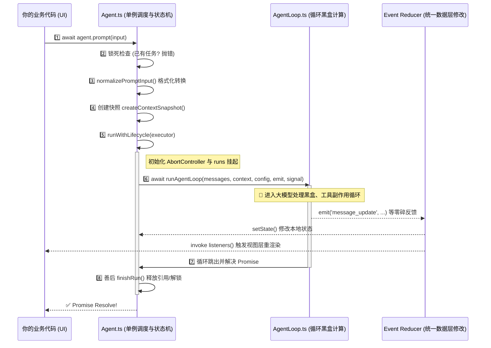

# 🌳 从 `agent.prompt()` 到 `agent_end`：Agent 的完整执行树探究

当我们向 AI 助手输入一段大白话，比如 `agent.prompt("帮我跑一下测试代码")`，看似这轻描淡写的一句调用，在 `pi-agent-core` 的内部却启动了一台庞大而精准的组装流水线。

如果你是一个对框架底层感兴趣的前端架构师，这篇指南会帮你详细拆解出这一棵隐匿在极简 API 背后的**巨大调用执行树 (Execution Tree)**。

---

## 🌲 全景流程透视图



---

## 🔍 第 1 步：入口拦截与参数归一化 (Surface Layer)

当 `agent.prompt("Hello")` 被调用：
首先触发的拦截机制是单例控制（Singleton Control）。在一个 `Agent` 实例上，**同一时间只允许存在一条线在往前跑**。

```typescript
// agent.ts -> prompt()
if (this.activeRun) {
  throw new Error("Agent is already processing a prompt...");
}
```

随后，走入 `normalizePromptInput`：不管你穿给 Agent 的是纯文本，还是带了图片的 `ImageContent[]`，亦或是本身就是一个装配好的 `AgentMessage` 对象，这一层防御代码全都会把它**拉平成标准的单向数据流请求体（包含时间戳戳印和 user 身份标记的数组）**。

## 🛡️ 第 2 步：护城河拦截期 `runWithLifecycle` (Lifecycle Lock)

这是 Agent 执行的真正中轴骨干线。

```typescript
private async runWithLifecycle(executor: (signal: AbortSignal) => Promise<void>) {
  // 1. 挂起锁并初始化取消信号牌
  const abortController = new AbortController();
  this.activeRun = { promise, resolve: resolvePromise, abortController };

  // 2. 修改业务 State，准备发车
  this._state.isStreaming = true;

  try {
    // 3. 将通行证 (Signal) 下放给闭包
    await executor(abortController.signal);
  } catch (error) {
    // 4. 出现意外全盘捕获！组装假消息告知业务出了错
    await this.handleRunFailure(error, abortController.signal.aborted);
  } finally {
    // 5. 不管成功失败，最后必然走到：卸磨杀驴、还原转圈 Loading 状态
    this.finishRun();
  }
}
```

这里使用了经典的“翻转控制”（Inversion of Control），把实际的 `runAgentLoop` 包在了一个闭包里，由外壳捕获任何意外情况，从而**保证框架级别的健壮性**。

## 📸 第 3 步：行前合影 `createContextSnapshot` (Shallow Clone)

在正式把你的聊天记录传给 AgentLoop 前，框架进行了一次防手贱的克隆操作：

```typescript
private createContextSnapshot(): AgentContext {
  return {
    systemPrompt: this._state.systemPrompt,
    messages: this._state.messages.slice(), // ⚡
    tools: this._state.tools.slice(),       // ⚡
  };
}
```

这里的 `.slice()` 是深谙 JS 引用的前端老贼所为：切断引用关系防止引擎在黑盒深处执行时，你的 UI 层突然向原始数组里推送/清空脏数据，导致执行上下文灾难崩溃。

## ⚙️ 第 4 步：扎入引擎黑盒 `runAgentLoop` (The Event Loop)

随后程序脱离了被你定义的 `Agent` 状态机大管家，下沉到了**纯函数式的无状态计算世界 `agent-loop.ts`**。

这是全项目最精华也最复杂的点，大致过程可以抽象为：
> 发送一堆初始化事件 (Emit Start)  ---> 触发 `runLoop(双层 while 控制)` ---> 在那里获取 LLM 网络请求响应 ---> 解析响应决定是不是调函数 ---> 触发 `tools` ---> 查看有无追加的新工作项 ---> 结束跳出！

这里的黑盒之所以能够影响外部世界，是因为在调用他时传进了我们之前见过的事件订阅接收器 `emit`：
```typescript
(event) => this.processEvents(event)
```

## 🪄 第 5 步：收发自如的 Redux Dispatcher 机制 

任何底层的大模型返回数据想进入到我们在屏幕上看到的对话流里，**全都要走 `processEvents` 这一个核心枢纽**（相当于 Redux 的全局 Root Reducer）！

这里其实大有门道，我们重点观察这三句：

```typescript
// agent.ts -> processEvents() 截取
const signal = this.activeRun?.abortController.signal;
for (const listener of this.listeners) {
  await listener(event, signal);
}
```

**为什么这是一个非常危险且强大的设计？**
1. **被顺序 `await` 拦截的 Listener**：如果你的 React Hook 或者回调监听器里做了一个耗时极慢的本地 IndexedDB 存储并且写了 await。不好意思大模型那边传来的新流式数据就会全部憋住，整个黑盒会**死锁**等待！
2. **永远附带 `signal` 通行证**：为了解决上面异步可能造成的“幽灵任务”，它派发事件时很懂事地给你附带了此刻这个轮次的 `Signal`，让你在自己写的长周期事件中能随时通过 `signal.aborted` 判断**用户是不是早就点取消了**！

## 🎉 第 6 步：终点站 `finishRun()`

当内部的双层大循环检测到无事可做，发起了终极指令 `emit({ type: "agent_end" })` 后，流开始返回，到达外层终点：

```typescript
private finishRun(): void {
  this._state.isStreaming = false; // 关闭转动的菊花 UI
  this.activeRun?.resolve(); // 解析你在外部 prompt 时挂载的那个巨型 Promise
  this.activeRun = undefined; // 释放内存！锁匠收摊
}
```

至此，`await agent.prompt("...")` 在你的 UI 侧代码中**终于执行到了下一行**！一场宏伟的流水线战役落下帷幕。
