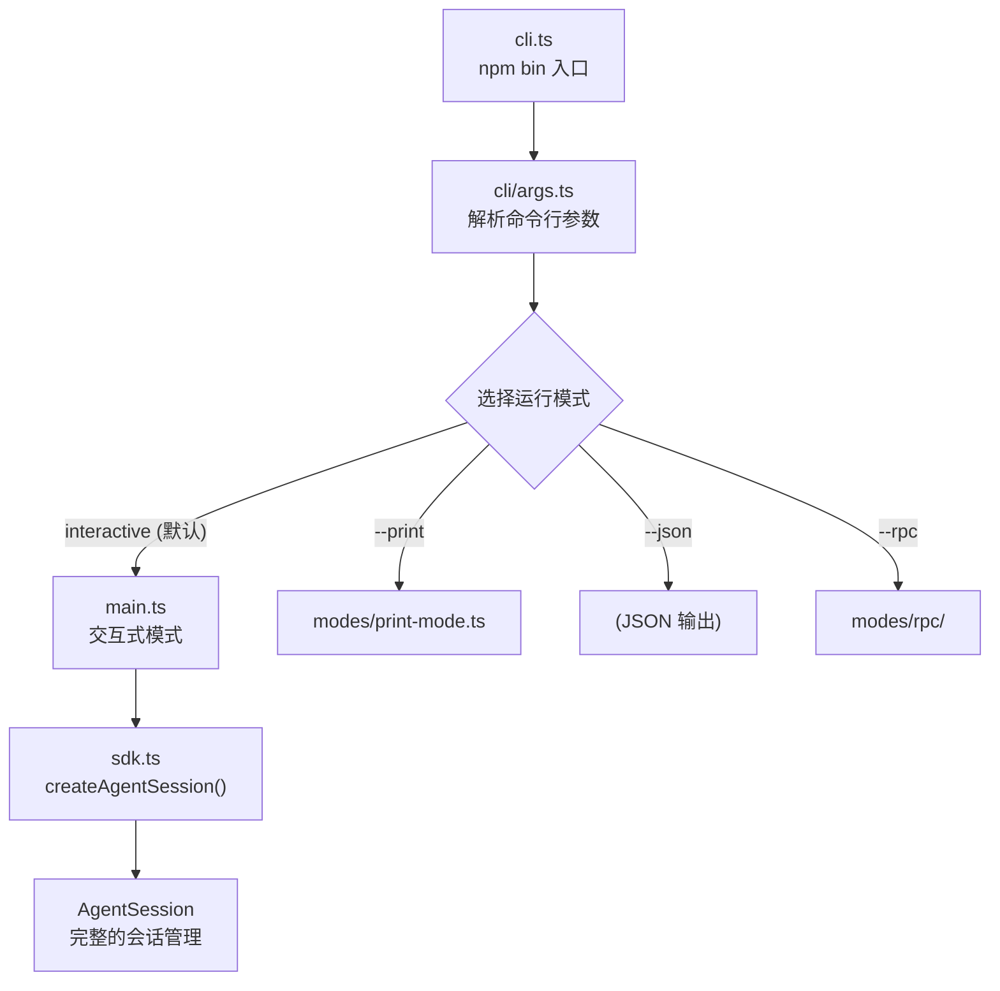
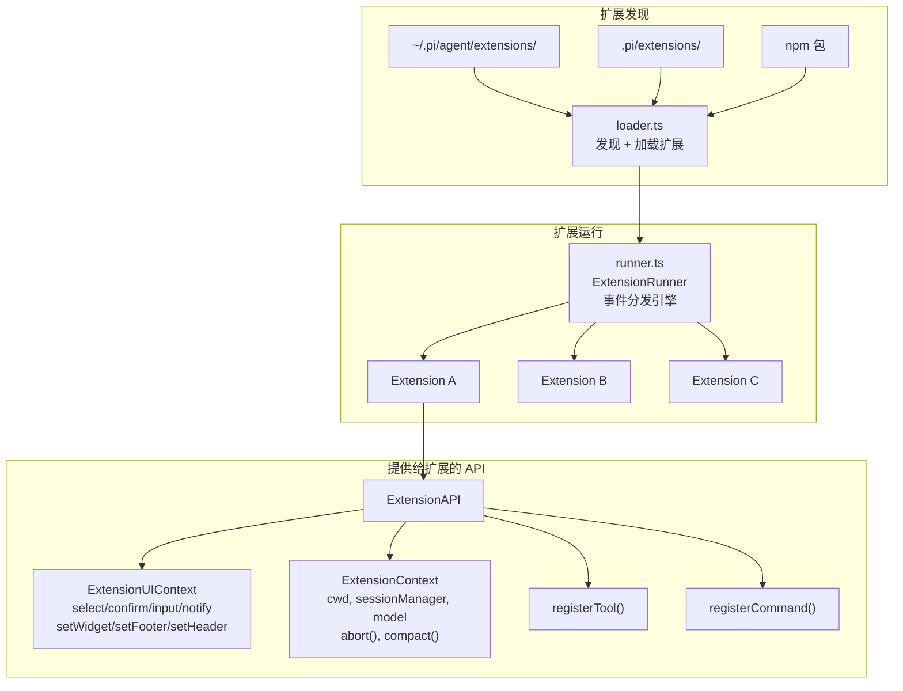
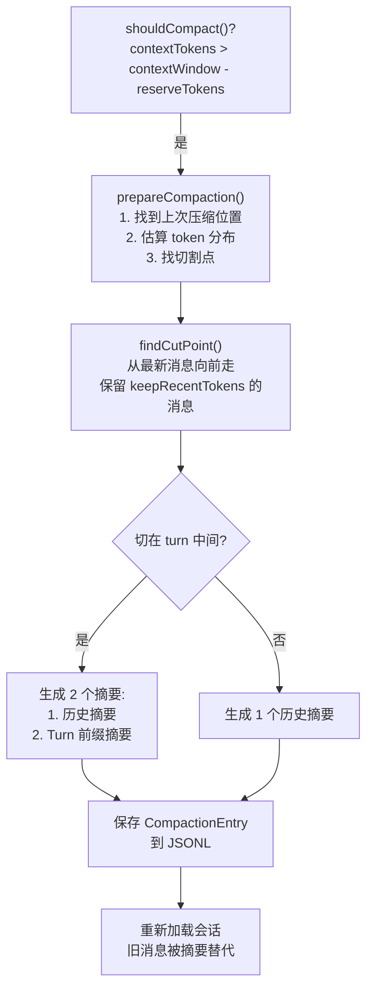
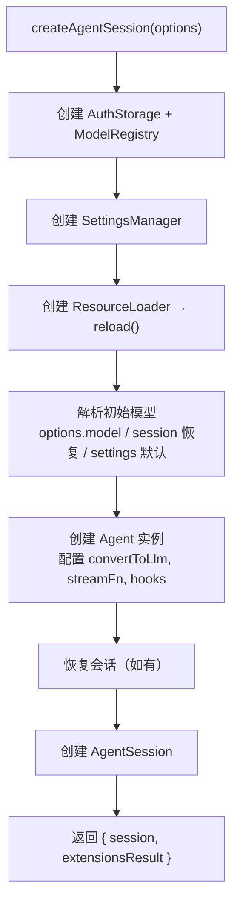
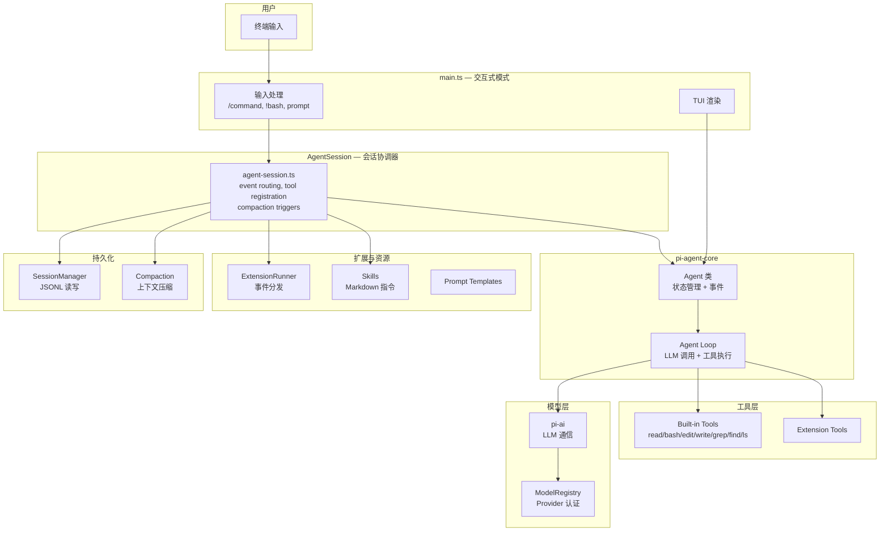

# pi-coding-agent 深度学习指南

> `@mariozechner/pi-coding-agent` — 一个生产级的编程 Agent 实现，在 pi-agent-core 之上构建了完整的 CLI 交互、工具系统、扩展系统、会话管理和上下文压缩。

---

## 目录

1. [包总览](#1-包总览)
2. [目录结构地图](#2-目录结构地图)
3. [入口层 — CLI 到交互式模式](#3-入口层--cli-到交互式模式)
4. [工具系统 (Tools)](#4-工具系统-tools)
5. [扩展系统 (Extensions)](#5-扩展系统-extensions)
6. [技能系统 (Skills)](#6-技能系统-skills)
7. [自定义消息类型 (Custom Messages)](#7-自定义消息类型-custom-messages)
8. [会话管理 (Session Manager)](#8-会话管理-session-manager)
9. [上下文压缩 (Compaction)](#9-上下文压缩-compaction)
10. [系统提示词 (System Prompt)](#10-系统提示词-system-prompt)
11. [SDK 入口 (createAgentSession)](#11-sdk-入口-createagentsession)
12. [架构全景图](#12-架构全景图)
13. [源码精读练习](#13-源码精读练习)

---

## 1. 包总览

pi-coding-agent 在 pi-agent-core 之上增加了一个生产级 CLI 编程助手需要的一切：

| 功能 | 对应的核心模块 | 作用 |
|------|--------------|------|
| 内置工具 | `core/tools/` | read, bash, edit, write, grep, find, ls |
| 扩展系统 | `core/extensions/` | 第三方插件：事件订阅、自定义工具、命令 |
| 技能系统 | `core/skills.ts` | Markdown 指令集，LLM 按需读取 |
| 会话管理 | `core/session-manager.ts` | JSONL 持久化、分支、树导航 |
| 上下文压缩 | `core/compaction/` | 长对话自动总结、token 管理 |
| 系统提示词 | `core/system-prompt.ts` | 动态构建 system prompt |
| 模型管理 | `core/model-registry.ts` | 多 Provider 认证和模型发现 |
| 运行模式 | `modes/` | interactive, print, json, rpc |
| CLI | `cli/` | 命令行参数解析 |

---

## 2. 目录结构地图

```
packages/coding-agent/src/
├── cli.ts                    ← npm bin 入口
├── main.ts                   ← 交互式模式主循环（600+ 行）
├── config.ts                 ← 路径和配置常量
│
├── cli/                      ← CLI 入口
│   ├── args.ts               ← 命令行参数解析
│   ├── initial-message.ts    ← 初始消息构建
│   ├── session-picker.ts     ← 会话选择器
│   └── ...
│
├── core/                     ← ★ 核心逻辑
│   ├── tools/                ← 内置工具（7 个）
│   │   ├── read.ts           ← 读取文件（支持图片）
│   │   ├── bash.ts           ← 执行命令
│   │   ├── edit.ts           ← 编辑文件
│   │   ├── write.ts          ← 写入文件
│   │   ├── grep.ts           ← ripgrep 搜索
│   │   ├── find.ts           ← fd 文件查找
│   │   ├── ls.ts             ← 目录列表
│   │   ├── truncate.ts       ← 输出截断策略
│   │   └── index.ts          ← 工具注册 + 工厂函数
│   │
│   ├── extensions/           ← 扩展系统
│   │   ├── types.ts          ← ExtensionAPI, 事件类型（1451 行 ★）
│   │   ├── loader.ts         ← 扩展发现和加载
│   │   ├── runner.ts         ← 扩展运行器（事件分发）
│   │   └── wrapper.ts        ← 工具包装器
│   │
│   ├── compaction/           ← 上下文压缩
│   │   ├── compaction.ts     ← 压缩算法
│   │   ├── branch-summarization.ts
│   │   └── utils.ts
│   │
│   ├── sdk.ts                ← createAgentSession() SDK 入口
│   ├── agent-session.ts      ← AgentSession 类（~2700 行，最大的文件）
│   ├── session-manager.ts    ← JSONL 会话持久化
│   ├── model-registry.ts     ← 模型注册和认证
│   ├── model-resolver.ts     ← 模型解析和选择
│   ├── skills.ts             ← 技能加载和格式化
│   ├── system-prompt.ts      ← 系统提示词构建
│   ├── messages.ts           ← 自定义消息类型 + convertToLlm
│   ├── settings-manager.ts   ← 用户设置管理
│   ├── keybindings.ts        ← 快捷键系统
│   └── ...
│
├── modes/                    ← 运行模式
│   ├── interactive/          ← TUI 交互模式
│   ├── print-mode.ts         ← 纯输出模式
│   └── rpc/                  ← RPC 模式
│
└── utils/                    ← 工具类
    ├── tools-manager.ts      ← fd/rg 二进制管理
    ├── git.ts                ← Git 操作
    ├── shell.ts              ← Shell 执行
    └── ...
```

---

## 3. 入口层 — CLI 到交互式模式

### 启动流程



### main.ts — 交互式主循环

`main.ts` 大约 600 行，是用户直接交互的入口。其核心逻辑：

```
1. 解析 CLI 参数
2. 调用 createAgentSession() 创建 AgentSession
3. 加载扩展 → 设置 ExtensionRunner
4. 初始化 TUI（终端 UI）
5. 进入主循环：
   ├── 等待用户输入
   ├── 处理 /slash 命令
   ├── 处理 !bash 命令
   └── 发送 prompt 给 Agent
6. 监听 Agent 事件 → 更新 TUI
```

---

## 4. 工具系统 (Tools)

> 目录：[core/tools/](file:///d:/MCPs/pi-mono/packages/coding-agent/src/core/tools)

### 4.1 内置工具概览

| 工具 | 文件 | 功能 | 关键特性 |
|------|------|------|---------|
| `read` | [read.ts](file:///d:/MCPs/pi-mono/packages/coding-agent/src/core/tools/read.ts) | 读取文件 | 支持图片、offset/limit 分页、自动截断 |
| `bash` | [bash.ts](file:///d:/MCPs/pi-mono/packages/coding-agent/src/core/tools/bash.ts) | 执行命令 | 超时控制、输出截断、流式进度 |
| `edit` | [edit.ts](file:///d:/MCPs/pi-mono/packages/coding-agent/src/core/tools/edit.ts) | 编辑文件 | diff 匹配、冲突检测 |
| `write` | [write.ts](file:///d:/MCPs/pi-mono/packages/coding-agent/src/core/tools/write.ts) | 写入文件 | 自动创建目录、文件锁 |
| `grep` | [grep.ts](file:///d:/MCPs/pi-mono/packages/coding-agent/src/core/tools/grep.ts) | 搜索 | 基于 ripgrep，尊重 .gitignore |
| `find` | [find.ts](file:///d:/MCPs/pi-mono/packages/coding-agent/src/core/tools/find.ts) | 查找文件 | 基于 fd |
| `ls` | [ls.ts](file:///d:/MCPs/pi-mono/packages/coding-agent/src/core/tools/ls.ts) | 列出目录 | 树形输出 |

**默认配置**：
```typescript
// 编码模式（默认）4 个工具
export const codingTools: Tool[] = [readTool, bashTool, editTool, writeTool];

// 只读模式 4 个工具
export const readOnlyTools: Tool[] = [readTool, grepTool, findTool, lsTool];
```

### 4.2 ToolDefinition — 增强版工具定义

coding-agent 的工具不是直接用 `AgentTool`，而是使用增强的 `ToolDefinition`：

```typescript
interface ToolDefinition<TParams, TDetails, TState> {
  // — AgentTool 的所有字段 —
  name: string;
  label: string;
  description: string;
  parameters: TParams;            // TypeBox schema
  execute(toolCallId, params, signal, onUpdate, ctx): Promise<AgentToolResult<TDetails>>;

  // — 增强字段 —
  promptSnippet?: string;         // 系统提示词中的一行摘要
  promptGuidelines?: string[];    // 附加到系统提示词 Guidelines 部分
  
  // ★ 自定义 TUI 渲染
  renderCall?(args, theme, context): Component;     // 工具调用时的 UI
  renderResult?(result, options, theme, context): Component; // 工具结果的 UI
}
```

> [!TIP]
> `ToolDefinition` 的 `execute` 多了最后一个参数 `ctx: ExtensionContext`，让工具可以访问会话管理、模型注册等上下文。而 `AgentTool` 的 `execute` 没有这个参数。

### 4.3 深读 read.ts — 一个工具的完整实现

以 [read.ts](file:///d:/MCPs/pi-mono/packages/coding-agent/src/core/tools/read.ts) 为例，一个完整的工具包含：

```typescript
// 1. Schema 定义
const readSchema = Type.Object({
  path: Type.String({ description: "Path to the file to read" }),
  offset: Type.Optional(Type.Number({ description: "Line number to start reading from (1-indexed)" })),
  limit: Type.Optional(Type.Number({ description: "Maximum number of lines to read" })),
});

// 2. ToolDefinition
export function createReadToolDefinition(cwd, options?): ToolDefinition {
  return {
    name: "read",
    label: "read",
    description: "Read the contents of a file...",
    promptSnippet: "Read file contents",                   // 系统提示词摘要
    promptGuidelines: ["Use read to examine files..."],    // Guidelines 注入
    parameters: readSchema,

    // 3. 执行逻辑
    async execute(_toolCallId, { path, offset, limit }, signal) {
      const absolutePath = resolveReadPath(path, cwd);
      // ... 读取文件、处理图片、截断输出 ...
      return { content: [...], details: { truncation } };
    },

    // 4. ★ TUI 渲染
    renderCall(args, theme, context) {
      // 渲染：read config.json:1-50
      return new Text(formatReadCall(args, theme));
    },
    renderResult(result, options, theme, context) {
      // 渲染：语法高亮的文件内容 + 截断提示
      return new Text(formatReadResult(...));
    },
  };
}

// 5. 工具工厂
export function createReadTool(cwd, options?): AgentTool {
  return wrapToolDefinition(createReadToolDefinition(cwd, options));
}
```

### 4.4 工具创建模式

每个工具提供 3 层 API：

```
createReadToolDefinition(cwd)  → ToolDefinition    // 最灵活，支持自定义渲染
createReadTool(cwd)            → AgentTool         // 标准 Agent 工具
readTool                       → AgentTool         // 预构建（uses process.cwd()）
```

---

## 5. 扩展系统 (Extensions)

> 目录：[core/extensions/](file:///d:/MCPs/pi-mono/packages/coding-agent/src/core/extensions)

### 5.1 什么是 Extension？

Extension 是一个 TypeScript 模块，可以：
- 订阅 Agent 生命周期事件（30+ 种事件）
- 注册 LLM 可调用的自定义工具
- 注册 `/slash` 命令和快捷键
- 通过 UI 原语（select, confirm, input, custom）与用户交互
- 注册自定义消息渲染器

### 5.2 Extension 架构



### 5.3 Extension 的事件类型 (30+)

[types.ts](file:///d:/MCPs/pi-mono/packages/coding-agent/src/core/extensions/types.ts) 是整个包最大的类型文件（1451 行）。事件分为 6 大类：

```
┌─────────────────────────────────────────────────┐
│ Resources Events                                 │
│   resources_discover → 返回额外的 skill/prompt 路径 │
├─────────────────────────────────────────────────┤
│ Session Events                                   │
│   session_start, session_before_switch          │
│   session_before_fork, session_before_compact   │
│   session_compact, session_shutdown             │
│   session_before_tree, session_tree             │
├─────────────────────────────────────────────────┤
│ Agent Events                                     │
│   context, before_agent_start, agent_start      │
│   agent_end, turn_start, turn_end               │
│   message_start, message_update, message_end    │
│   tool_execution_start/update/end               │
│   before_provider_request                        │
├─────────────────────────────────────────────────┤
│ Input Events                                     │
│   input → 可以拦截/转换用户输入                    │
├─────────────────────────────────────────────────┤
│ Tool Events                                      │
│   tool_call → 可以拦截/修改工具调用               │
│   tool_result → 可以修改工具结果                  │
├─────────────────────────────────────────────────┤
│ Model Events                                     │
│   model_select → 模型切换通知                     │
│ User Bash Events                                 │
│   user_bash → 用户 !命令 通知                     │
└─────────────────────────────────────────────────┘
```

### 5.4 ExtensionContext — 扩展能做什么

```typescript
interface ExtensionContext {
  ui: ExtensionUIContext;        // UI 交互
  hasUI: boolean;                // 是否有 UI（print/rpc 模式没有）
  cwd: string;                   // 工作目录
  sessionManager: ReadonlySessionManager;  // 会话管理（只读）
  modelRegistry: ModelRegistry;  // 模型注册
  model: Model | undefined;     // 当前模型
  isIdle(): boolean;             // Agent 是否空闲
  signal: AbortSignal | undefined; // 当前 abort signal
  abort(): void;                 // 中止 Agent
  shutdown(): void;              // 关闭 pi
  compact(options?): void;       // 触发压缩
  getSystemPrompt(): string;     // 获取当前系统提示
}
```

---

## 6. 技能系统 (Skills)

> 文件：[core/skills.ts](file:///d:/MCPs/pi-mono/packages/coding-agent/src/core/skills.ts)

### 6.1 什么是 Skill？

Skill 是 **Markdown 文件**，遵循 [Agent Skills 标准](https://agentskills.io)。它不是代码插件，而是 **指令集**——告诉 LLM 如何完成特定任务。

### 6.2 Skill 结构

```markdown
---
name: deploy-vercel
description: "Deploy Next.js applications to Vercel"
---

# Deploy to Vercel

## Steps
1. Run `vercel login` to authenticate
2. Run `vercel --prod` from the project root
3. Verify deployment at the provided URL
...
```

### 6.3 Skill 发现路径

```
优先级（先找到的优先）：
1. ~/.pi/agent/skills/     ← 全局用户 skills
2. .pi/skills/             ← 项目级 skills
3. --skill-path 参数       ← 命令行指定
```

发现规则：
- 如果目录包含 `SKILL.md`，则整个目录是一个 skill，不再递归
- 根目录下的 `.md` 文件直接作为 skill
- 支持 `.gitignore` 模式忽略
- 名称冲突时先发现的优先

### 6.4 Skill 在系统提示词中的注入

```typescript
function formatSkillsForPrompt(skills: Skill[]): string {
  // 生成 XML 格式的 skill 列表
  // LLM 看到后，当任务匹配 description 时，会自动 read 对应文件
  return `
  <available_skills>
    <skill>
      <name>deploy-vercel</name>
      <description>Deploy Next.js applications to Vercel</description>
      <location>/path/to/deploy-vercel/SKILL.md</location>
    </skill>
  </available_skills>`;
}
```

> [!NOTE]
> **Skill vs Extension 的区别**：
> - Skill = Markdown 指令，LLM 按需读取 → 零代码，任何人可写
> - Extension = TypeScript 插件，运行在 Agent 进程中 → 可以拦截事件、注册工具、修改行为

---

## 7. 自定义消息类型 (Custom Messages)

> 文件：[core/messages.ts](file:///d:/MCPs/pi-mono/packages/coding-agent/src/core/messages.ts)

### 7.1 Declaration Merging 扩展消息类型

coding-agent 通过 TypeScript declaration merging 添加了 4 种自定义消息：

```typescript
// 扩展 pi-agent-core 的 CustomAgentMessages 接口
declare module "@mariozechner/pi-agent-core" {
  interface CustomAgentMessages {
    bashExecution: BashExecutionMessage;      // 用户 !命令 执行结果
    custom: CustomMessage;                     // 扩展注入的自定义消息
    branchSummary: BranchSummaryMessage;       // 分支摘要
    compactionSummary: CompactionSummaryMessage; // 压缩摘要
  }
}
```

### 7.2 convertToLlm — 消息转换器

这是 `Agent` 构造时传入的 `convertToLlm` 函数：

```typescript
function convertToLlm(messages: AgentMessage[]): Message[] {
  return messages.map(m => {
    switch (m.role) {
      case "bashExecution":
        if (m.excludeFromContext) return undefined;  // !! 命令不发给 LLM
        return { role: "user", content: [{ type: "text", text: bashExecutionToText(m) }] };
      
      case "custom":
        return { role: "user", content: /* ... */ };
      
      case "branchSummary":
        return { role: "user", content: [{ type: "text", text: `<summary>${m.summary}</summary>` }] };
      
      case "compactionSummary":
        return { role: "user", content: [{ type: "text", text: `<summary>${m.summary}</summary>` }] };
      
      case "user":
      case "assistant":
      case "toolResult":
        return m; // 标准消息直接传递
    }
  }).filter(Boolean);
}
```

> [!IMPORTANT]
> **这就是 AgentMessage 和 LLM Message 分离的实际体现**。自定义消息在 Agent 内部用于状态管理和 UI 渲染，发给 LLM 时被转换成 `user` 消息或被过滤掉。

---

## 8. 会话管理 (Session Manager)

> 文件：[core/session-manager.ts](file:///d:/MCPs/pi-mono/packages/coding-agent/src/core/session-manager.ts) (~1100 行)

### 8.1 JSONL 持久化格式

每个会话是一个 `.jsonl` 文件，每行一个 JSON 对象（entry）：

```jsonl
{"id":"uuid-1","type":"session_info","version":1,"timestamp":"..."}
{"id":"uuid-2","type":"model_change","provider":"anthropic","modelId":"claude-sonnet-4-20250514","parentId":"uuid-1"}
{"id":"uuid-3","type":"thinking_level_change","level":"medium","parentId":"uuid-2"}
{"id":"uuid-4","type":"message","message":{"role":"user","content":"Hello","timestamp":1234},"parentId":"uuid-3"}
{"id":"uuid-5","type":"message","message":{"role":"assistant","content":[...],"stopReason":"stop"},"parentId":"uuid-4"}
```

### 8.2 Entry 类型

| Entry Type | 说明 |
|------------|------|
| `session_info` | 会话元数据 |
| `model_change` | 模型切换记录 |
| `thinking_level_change` | 思考级别切换 |
| `message` | 消息（user/assistant/toolResult/自定义） |
| `custom_message` | 扩展注入的消息 |
| `compaction` | 压缩摘要 |
| `branch_summary` | 分支摘要 |
| `label` | 标记标签 |

### 8.3 树形结构 (branching)

会话不是线性的，而是一棵树：

```
              session_info
                 │
              model_change
                 │
              user: "帮我重构"
                 │
            ┌─── assistant: plan A ───── user: "换个思路"
            │                              │
            │                           assistant: plan B
            │
            └── [compact] ← 压缩了 plan A 分支
```

每个 entry 有 `id` 和 `parentId`，构成 DAG（有向无环图）。`getBranch()` 从叶子回溯到根，得到当前活跃的线性路径。

---

## 9. 上下文压缩 (Compaction)

> 目录：[core/compaction/](file:///d:/MCPs/pi-mono/packages/coding-agent/src/core/compaction)

### 9.1 为什么需要压缩？

LLM 有 context window 限制（如 200K tokens）。长对话会超出限制。压缩通过 **LLM 自身**来总结旧消息。

### 9.2 压缩流程



### 9.3 切割点算法

```typescript
function findCutPoint(entries, startIndex, endIndex, keepRecentTokens): CutPointResult {
  // 从最新的 entry 向前走，累加 token 估算
  // 当累加超过 keepRecentTokens 时，找到最近的有效切割点
  // 有效切割点 = user 消息、assistant 消息、bashExecution（不能是 toolResult）
  
  return {
    firstKeptEntryIndex,  // 保留的第一个 entry
    turnStartIndex,       // 如果切在 turn 中间，turn 开始位置
    isSplitTurn,          // 是否切在 turn 中间
  };
}
```

> [!NOTE]
> **关键细节**：切割点不能是 `toolResult`，因为 toolResult 必须紧跟在它对应的 assistant toolCall 后面。如果切在 toolResult 上，LLM 会得到没有前置 toolCall 的 toolResult，导致错误。

### 9.4 摘要生成

压缩使用 LLM 自身来总结对话，使用结构化模板：

```
## Goal
## Constraints & Preferences
## Progress
### Done / ### In Progress / ### Blocked
## Key Decisions
## Next Steps
## Critical Context
```

如果已有前一次压缩的摘要，会使用 **增量更新**（UPDATE_SUMMARIZATION_PROMPT），而不是从头总结。

---

## 10. 系统提示词 (System Prompt)

> 文件：[core/system-prompt.ts](file:///d:/MCPs/pi-mono/packages/coding-agent/src/core/system-prompt.ts)

### 10.1 动态构建

系统提示词不是静态字符串，而是动态构建的：

```typescript
function buildSystemPrompt(options): string {
  // 1. 如果有 customPrompt，使用它（替换默认）
  // 2. 否则构建默认 prompt:
  //    - 基础角色描述
  //    - Available tools（只显示有 promptSnippet 的工具）
  //    - Guidelines（根据可用工具动态生成 + 工具的 promptGuidelines）
  //    - Pi 文档路径
  //    - appendSystemPrompt（用户追加内容）
  //    - Project Context（.pi/context 文件内容）
  //    - Skills（available_skills XML）
  //    - 当前日期和工作目录
}
```

### 10.2 提示词层次结构

```
┌── 基础角色："You are an expert coding assistant operating inside pi..."
├── Available tools: "- read: Read file contents"
├── Guidelines: "- Use read to examine files instead of cat or sed"
├── ————————————————————————————————
├── appendSystemPrompt（用户自定义追加）
├── ————————————————————————————————
├── # Project Context
│   ## .pi/context/AGENTS.md（项目级指令）
│   ## .pi/context/rules.md
├── ————————————————————————————————
├── <available_skills>（技能列表 XML）
├── ————————————————————————————————
├── Current date: 2026-04-10
└── Current working directory: /path/to/project
```

---

## 11. SDK 入口 (createAgentSession)

> 文件：[core/sdk.ts](file:///d:/MCPs/pi-mono/packages/coding-agent/src/core/sdk.ts)

这是 **编程方式使用 coding-agent 的入口**：

```typescript
import { createAgentSession, codingTools } from "@mariozechner/pi-coding-agent";
import { getModel } from "@mariozechner/pi-ai";

const { session, extensionsResult } = await createAgentSession({
  model: getModel("anthropic", "claude-sonnet-4-20250514"),
  thinkingLevel: "medium",
  tools: codingTools,
  cwd: process.cwd(),
});

// session 是 AgentSession 实例
// 可以订阅事件、发送 prompt、管理会话
```

### createAgentSession 做了什么？



#### 关键配置

```typescript
// Agent 的 streamFn 被包装，自动从 modelRegistry 获取 API key
streamFn: async (model, context, options) => {
  const auth = await modelRegistry.getApiKeyAndHeaders(model);
  return streamSimple(model, context, { ...options, apiKey: auth.apiKey, headers: auth.headers });
},

// convertToLlm 包装了 blockImages 设置
convertToLlm: (messages) => {
  const converted = convertToLlm(messages);
  if (settingsManager.getBlockImages()) {
    // 把所有 ImageContent 替换成 "Image reading is disabled." 文本
  }
  return converted;
},

// transformContext 委托给 Extension Runner
transformContext: async (messages) => {
  return runner.emitContext(messages); // 让扩展修改上下文
},
```

---

## 12. 架构全景图



---

## 13. 源码精读练习

### 练习 1：追踪一次工具注册

从 `createCodingTools(cwd)` 开始追踪：

```
createCodingTools(cwd)
  → createReadTool(cwd)
    → createReadToolDefinition(cwd)    // ToolDefinition
    → wrapToolDefinition(definition)   // ToolDefinition → AgentTool
```

阅读 [tool-definition-wrapper.ts](file:///d:/MCPs/pi-mono/packages/coding-agent/src/core/tools/tool-definition-wrapper.ts)，回答：
1. `wrapToolDefinition` 如何把 `ToolDefinition.execute(id, params, signal, onUpdate, ctx)` 转换成 `AgentTool.execute(id, params, signal, onUpdate)`？（提示：`ctx` 来自哪里？）

### 练习 2：追踪自定义消息的完整生命周期

1. 用户输入 `!ls -la`
2. 在 [messages.ts](file:///d:/MCPs/pi-mono/packages/coding-agent/src/core/messages.ts) 中找到 `BashExecutionMessage` 的定义
3. 追踪它如何被创建、存储到 session、转换为 LLM 消息

**问题**：
1. `!!ls -la`（双感叹号）和 `!ls -la` 的区别是什么？（提示：`excludeFromContext`）
2. BashExecutionMessage 在 `convertToLlm` 中变成了什么角色的消息？

### 练习 3：理解压缩时机

阅读 [compaction.ts](file:///d:/MCPs/pi-mono/packages/coding-agent/src/core/compaction/compaction.ts)，回答：

1. `shouldCompact()` 的触发条件是什么？
2. `keepRecentTokens`（默认 20000）是什么意思？
3. 为什么不能在 `toolResult` 处切割？
4. 如果上次已经压缩过，新的压缩是从头总结还是增量更新？

### 练习 4：编写一个最小 Extension

```typescript
import type { ExtensionFactory } from "@mariozechner/pi-coding-agent";

const myExtension: ExtensionFactory = {
  name: "my-extension",
  version: "1.0.0",
  
  create(api) {
    // 注册一个 /hello 命令
    api.registerCommand({
      name: "hello",
      description: "Say hello",
      execute: async (args, ctx) => {
        ctx.ui.notify("Hello from my extension!", "info");
      },
    });

    // 注册一个自定义工具
    api.registerTool({
      name: "current_time",
      label: "Current Time",
      description: "Get the current date and time",
      parameters: Type.Object({}),
      execute: async () => ({
        content: [{ type: "text", text: new Date().toISOString() }],
        details: {},
      }),
    });

    // 监听 Agent 事件
    return {
      on: {
        agent_start: async () => {
          console.log("[my-ext] Agent started");
        },
        tool_call: async (event) => {
          if (event.toolName === "bash") {
            console.log(`[my-ext] Bash: ${event.input.command}`);
          }
          return { action: "continue" };
        },
      },
    };
  },
};
```

**问题**：
1. `tool_call` 事件返回 `{ action: "block" }` 会发生什么？
2. Extension 能访问 `SessionManager` 吗？是只读还是可写？

---

## 快速参考表

| 你想做什么 | 看什么 |
|-----------|--------|
| 理解内置工具如何实现 | [core/tools/read.ts](file:///d:/MCPs/pi-mono/packages/coding-agent/src/core/tools/read.ts) — 最佳入门工具 |
| 理解 ToolDefinition vs AgentTool | [core/tools/index.ts](file:///d:/MCPs/pi-mono/packages/coding-agent/src/core/tools/index.ts) |
| 理解扩展 API 的全部能力 | [core/extensions/types.ts](file:///d:/MCPs/pi-mono/packages/coding-agent/src/core/extensions/types.ts) |
| 理解自定义消息类型 | [core/messages.ts](file:///d:/MCPs/pi-mono/packages/coding-agent/src/core/messages.ts) |
| 理解会话持久化 | [core/session-manager.ts](file:///d:/MCPs/pi-mono/packages/coding-agent/src/core/session-manager.ts) |
| 理解上下文压缩 | [core/compaction/compaction.ts](file:///d:/MCPs/pi-mono/packages/coding-agent/src/core/compaction/compaction.ts) |
| 理解系统提示词构建 | [core/system-prompt.ts](file:///d:/MCPs/pi-mono/packages/coding-agent/src/core/system-prompt.ts) |
| 理解 SDK 用法 | [core/sdk.ts](file:///d:/MCPs/pi-mono/packages/coding-agent/src/core/sdk.ts) `createAgentSession()` |
| 理解工具二进制管理 | [utils/tools-manager.ts](file:///d:/MCPs/pi-mono/packages/coding-agent/src/utils/tools-manager.ts) |
